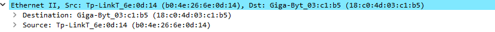
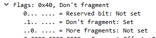
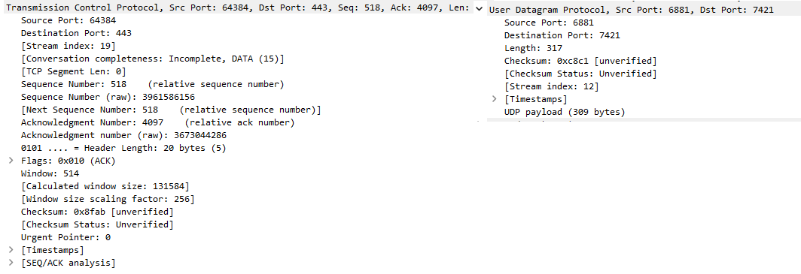

### Задание 1
---

Исходя из производиетелей сетевого оборудования определенных по MAC-адресу можно увидеть что пакет идет от роутера TP-Link к сетевой карте на материнской плате от Gigabyte

### Задание 2
---

в данном IP заголовке 3 флага: нулевой всегда равен нуль, первый флаг единица - запрещающий фрагментацию пакета; второй флаг нулевой, т.к. указывает на смещение при фрагментации, а фрагментация данного пакета запрещена

### Задание 3
---

Сравнив пакет TCP и UDP невооруженным взглядом видноЮ что заголовок UDP имеет меньшее количество полей чем заголовок TCP. Из общего у них разве что адрес назначения и источника. Заговловок TCP имеет дополнительные поля которые несут информацию в рамках установленной сессии после тройного рукопожатия между источником и назначением.

### Задание 4
---
При выборе потока HTTP мы видим что в фильтре на самом деле отслеживается поток TCP что в полне логично, т.к. пакет HTTP вложен в пакет транспортного уровня TCP.