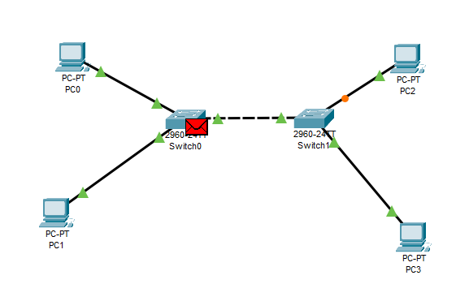
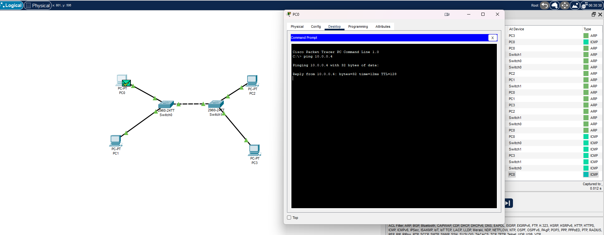
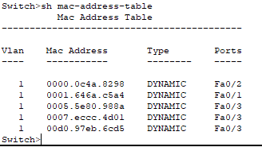

### Задание 1
---

### Задание 2
---

### Задание 3
---

### Задание 4
---
Будет петля, которая в обычных коммутаторах приведет к сбою в работе сети, т.к. пакеты будут петлять от коммутатора к коммутатору. В более продвинутых коммутаторах должен отработать протокол STP, который как раз и занимаятся выявлением петель в сети и отключением портов создающих их. В CPT мы увидим что при подключении дополнительного кабеля между коммутаторами линк по ним не поднимится или с одной стороны будет не активный порт.