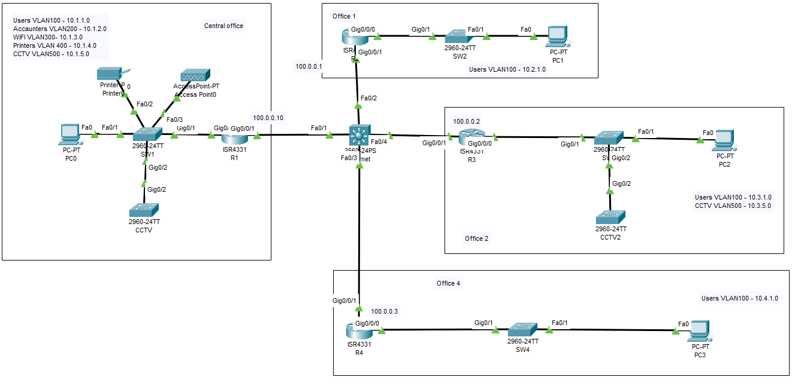

# Домашнее задание к занятию "Подходы и методологии проектирования корпоративных сетей"

### Цель задания

Научиться проектировать и создавать корпоративные сети с возможностью масштабирования

------

### Инструкция к выполнению домашнего задания

1. Сделайте копию [Шаблона для домашнего задания](https://docs.google.com/document/d/1youKpKm_JrC0UzDyUslIZW2E2bIv5OVlm_TQDvH5Pvs/edit) себе на Google Disk.
2. В названии файла введите корректное название лекции и вашу фамилию и имя.
3. Зайдите в “Настройки доступа” и выберите доступ “Просматривать могут все в Интернете, у кого есть ссылка”.  Ссылка на инструкцию [Как предоставить доступ к файлам и папкам на Google Диске](https://support.google.com/docs/answer/2494822?hl=ru&co=GENIE.Platform%3DDesktop)
4. Скопируйте текст задания в свой документ.
5. Выполните домашнее задание, запишите ответы и приложите необходимые скриншоты в свой Google Doc.
6. Для проверки домашнего задания преподавателем отправьте ссылку на ваш документ в личном кабинете.
7. Любые вопросы по решению задач задавайте в чате учебной группы.

---

### Лабораторная работа "Построение корпоративной сети"

### Задание 1

Руководство организации, в которой вы работаете сообщило вам, что компания расширяется. В следующем месяце в планах открыть новые офисы в соседнем регионе.

Перед вами поставили следующие требования:

1. Будут 4 офиса: 1 центральный и 3 отдаленных мини-офиса.
2. В центральном офисе планируется разместить 35 сотрудников из следующих отделов:
- ТОП-менеджеры
- менеджеры по продажам
- IT-отдел
- служба безопасности
- бухгалтерия
3. В центральном офисе помимо рабочих станций будут: принтеры, устройства для подключения к сети Wi-Fi, камеры видеонаблюдения.
4. В остальных мини-офисах планируется разместить:
- в первом: производственный цех с 15 сотрудниками, их рабочие станции и принтер
- во втором: склад с 6 сотрудниками, их рабочие станции и камеры видеонаблюдения
- в третьем: магазин по продаже изготовленной продукции с 5 сотрудниками, их рабочие станции, принтер и кассовое устройство
5. При проектировании сети в Packet Tracer не требуется подключение всех оконечных устройств (компьютеров пользователей, периферийных устройств и так далее). 
Подключение по одному устройству каждого типа достаточно для проверки выполнения наличия связанности.
6. Сотрудники всех мини-офисов должны иметь доступ к инфраструктуре центрального офиса.
7. IPv6 адресация в работе не рассматривается.

В Cisco Packet Tracer необходимо спроектировать и настроить сеть согласно условиям задания. Составить адресный план. Число и функционал коммутаторов доступа вы определяете самостоятельно.

*Отправьте pkt-файл и приложите краткое описание используемых решений.*

[8.01 net.pkt](./files/8.01%20net.pkt)
