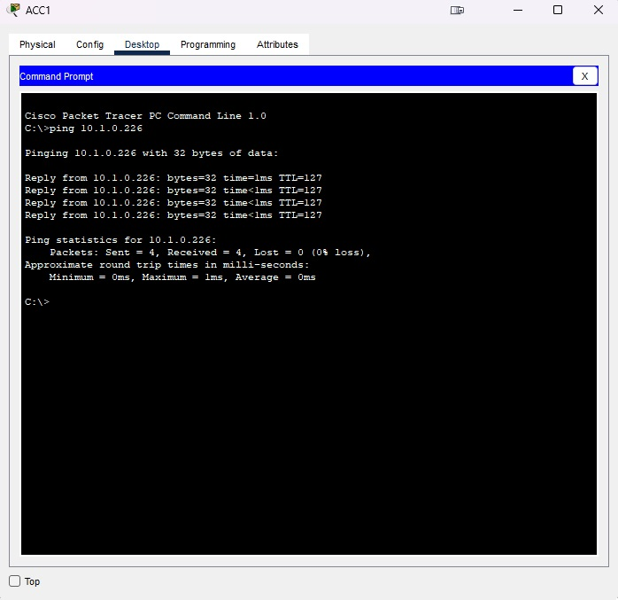
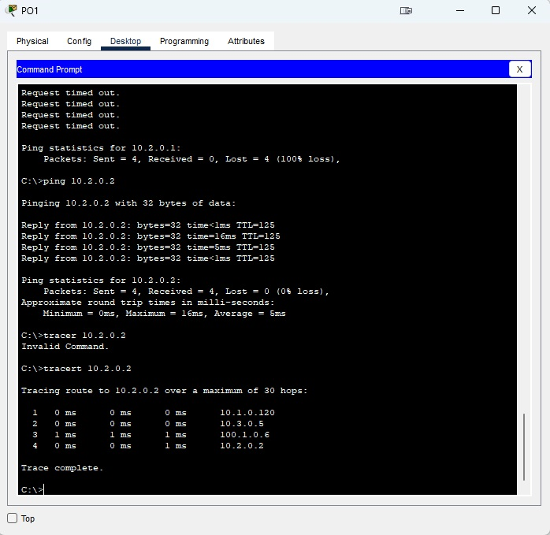
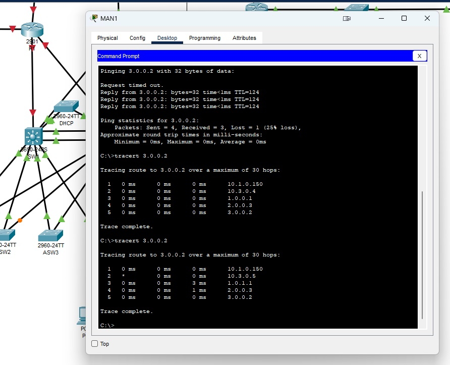

# Курсовой проект "Проектирование корпоративной сети"

Студент: Иван Литовка

* [Цель проекта](#цель-курсового-проекта)
* [IP адресация](#IP-адресация)
* [Интернет](#интернет)
* [Подключение производства к головному офису](#Подключение-производства-к-головному-офису) 
* [Тестирование](#тестирование) 

[work.pkt](./work.pkt) - файл с построенной сетью
[network.xlsx](./network.xlsx) - файл с описание сетей и ключевыми настройками оборудования

### Цель курсового проекта

Курсовой проект направлен на отработку знаний, полученных в ходе прохождения курса, и самостоятельное применение отдельных навыков при реализации комплексной задачи по проектированию и развертыванию сетевой инфраструктуры небольшой компании. Данная работа позволит отработать навыки для решения комплексных задач, возникающих в практике сетевого инженера.  

В результате выполнения этого проекта вы:

1. Научитесь формировать адресный план предприятия;
2. Проектировать сетевую инфраструктуру на базе технического задания;
3. Разворачивать сеть на основании спроектированного решения;
4. Обосновывать выбранные технические решения для их защиты перед внешними экспертами.

### IP адресация

Для адрессации в главном оффисе и производстве использована выше указанная схема. Маски подсетей выбраны уже с перспективой роста сети, т.к. разбивать еще меньшие подсети приведет к постоянной перенастройке оборудования в процессе роста сети. Для раздачи адресов рабочих станций в сети развернут DHCP на базе коммутатора cisco 2960.

### Интернет

В процессе развертывания сети выявилось недостаточное количество портов для подключения оборудованя к маршрутизатору R1, было принято решение установить плату коммутации с 4 портами FastEthernet, аналогичная плата была установлена в маршрутизатор R2. Благодоря установленным платам были созданы vlan интерфейсы на маршрутизаторах, одноименные vlan интерфейсы на маршрутизаторах R1 и R2 были объеденине протоколом FHRP и полученные vIP являются шлюзом по умолчанию для каждого vlan. На каждом vlan интерфейсе висят запрещающие правила для vlan'ов не позволяющие рабочим станциям из одного отдела получать доступ к рабочим станциям другого.

### Подключение производства к головному офису

Для подключения производства к головному офису построены туннели: R1-R3 и R2-R3, вся маршрутная информация в сети головного оффиса, производства и объединяющих их тунелей передается при помощи протокола EIGRP.

### Тестирование

- ПК сегмента производственного отдела, гостевого Wi-Fi и имеют доступ в сеть интернет.

- ПК на производстве имеет доступ в интернет и выходит в него через ISP3 (дополнительно приложить вывод traceroute).

- ПК на производстве имеет доступ к принтерам центрального офиса и сети производства центрального офиса, однако не имеют доступа к сегменту бухгалтерии.

- ПК в сегменте гостевого Wi-Fi не имеет доступа к сегменту производственного отдела.

- ПК в сегменте бухгалтерии имеют доступ к принтерам.

- ПК производственного отдела не может взаимодействовать с ПК из отдела продаж, ИТ отдела и бухгалтерии.

- ПК, подключенное в сегмент периферийных устройств, не имеет доступа в интернет. 

Провести тестирование используемых механизмов обеспечения отказоустойчивости. Для каждого из следующих пунктов снять трассировки из точки А в точку Б до начала теста и после отключения одного из элементов сети. 

- Точка А – ПК в бухгалтерии, точка Б – интернет (3.0.0.2). Отключение ISP1, проверка, что центральный офис перешел на ISP2. 

Из трасировки мы видем, как изменился второй хоп. Из-за отключения ISP1 на R1 был потерян линк на Gi0/0 в связи с чем понижен приоритет в FHRP и vIP был передан на R2

- Точка А – ПК в производственном отделе, точка Б – пользователь на производстве. Отключение ISP1, проверка, что связь между офисом и производством не прервалась.

отключение ISP1 на связь с производством не повлияла.

- Точка А – ПК в отделе продаж, точка Б – интернет (3.0.0.2). Полное отключение маршрутизатора, к которому подключен ISP1, проверка того, что центральный офис перешел на второй маршрутизатор. 

Отключение R1 не повлияло на доступ к интернету

- Точка А – ПК в производственном отделе, точка Б – пользователь на производстве. Полное отключение маршрутизатора, к которому подключен ISP1, проверка того, что связь до производства перешла на второй маршрутизатор. 

Отключение R1 не разрывает связь с удаленным офисом

- Точка А – ПК в бухгалтерии, точка Б – интернет (3.0.0.2). Отключение устройства, на котором расположены адреса шлюзов по умолчанию для внутренних сетей в центральном офисе. Проверка того, что адрес шлюза стал доступен через резервное устройство.

Все маршруты по умолчанию являются виртуальными IP, виртуальный IP был передан SW2

- Точка А – ПК в бухгалтерии, точка Б – интернет (3.0.0.2). Поочередное отключение каждого из линков, подключенных к коммутатору доступа, где расположена точка А. Проверка того, что выход из строя одного из линков не нарушает связность.

Коммутатор доступа подключен к SW1 и SW2

Линк к SW1 был удаленн, связанность осталась

ПРИМЕЧАНИЕ. В связи с особенностью эмулятора Packet Tracer, часто бывает так, что для того, чтобы тест заработал, нужно перезагрузить устройства. 

