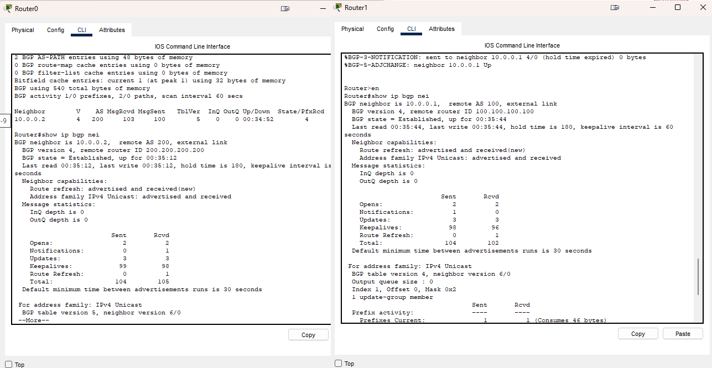

# Домашнее задание к занятию "Маршрутизация в сети Интернет. Автономные системы"


### Задание 1

Маршрутизатор А объявляет свою собственную сеть 172.17.1.0 своим одноранговым узлам BGP. 
- Какой маршрутной информацией будет обладать маршрутизатор D о доступности сети 172.17.1.0?

По сути он должен знать оба пути, но т.к. является дистанционно-векторным протоколом, то выберит наикратчайший путь через Router E

- Как будут выглядеть атрибуты AS-path? 

AS-PATH[60000,55000]

AS-PATH[45000,50000,55000]

- Через какие роутеры пройдет трафик при передаче информации от маршрутизатора D к маршрутизатору А?

через Роутер Е


*Приведите ответ в свободной форме.*

---

### Задание 2

Что означает следующий узел 0.0.0.0 в выходных данных команды show ip bgp?

*Приведите ответ в свободной форме.*

Шлюз по умолчанию, или выход в соседнюю АС. Наверное это значение в какую АС заворачивать трафик если не известны другие маршруты.

### Задание 3. Лабораторная работа "Настройка конфигурации BGP"

В Cisco Packet Tracer соберите сеть, состоящую из двух маршрутизаторов R1 и R2, находящиеся в разных AS. Настройте между ними BGP.

*Приведите скриншоты, где на R1 и R2 BGP-соединение в статусе Established. Пришлите pkt файл.*

---
   
[4.4.pkt](./files/4.4.pkt)

### Задание 4*

На основе лабораторной работы в Задании 3 к маршрутизатору R1 добавьте еще маршрутизатор R3 и сделайте так, чтобы R1 передавал нам только маршрут по умолчанию и ничего лишнего.

*Приведите скриншот маршрутизатора R1, где отображена таблица BGP. Пришлите pkt файл.*

---

Не понимаю как это сделать, что куда писать. на R3 вобще ничего не передается, но когда я его добавил в сети bgp то к этой подсети на R2 появилась информация. Прошу показать решение   

[4.4.pkt](./files/4.4.pkt)

```
Router#show ip route 
Codes: L - local, C - connected, S - static, R - RIP, M - mobile, B - BGP
       D - EIGRP, EX - EIGRP external, O - OSPF, IA - OSPF inter area
       N1 - OSPF NSSA external type 1, N2 - OSPF NSSA external type 2
       E1 - OSPF external type 1, E2 - OSPF external type 2, E - EGP
       i - IS-IS, L1 - IS-IS level-1, L2 - IS-IS level-2, ia - IS-IS inter area
       * - candidate default, U - per-user static route, o - ODR
       P - periodic downloaded static route

Gateway of last resort is not set

     10.0.0.0/8 is variably subnetted, 3 subnets, 2 masks
C       10.0.0.0/24 is directly connected, GigabitEthernet0/0/0
L       10.0.0.2/32 is directly connected, GigabitEthernet0/0/0
B       10.10.0.0/24 [20/0] via 10.0.0.1, 00:00:00
```