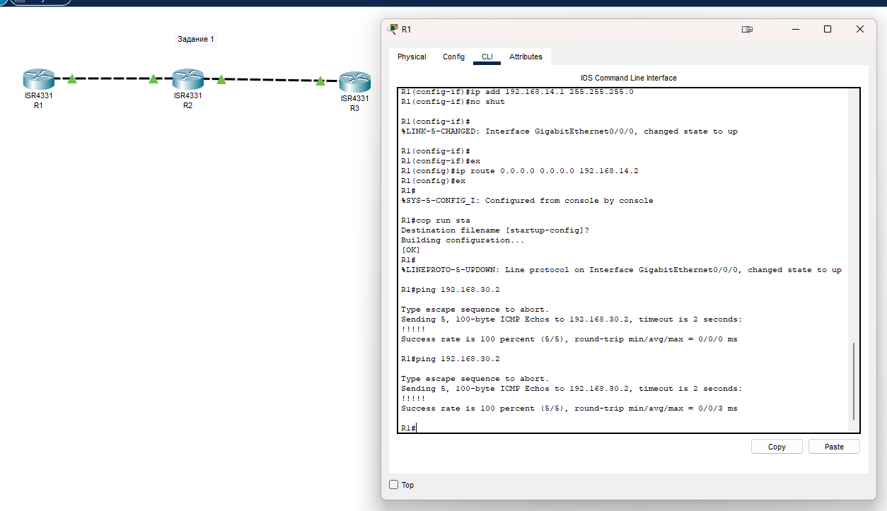
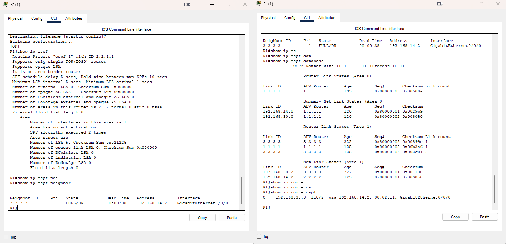
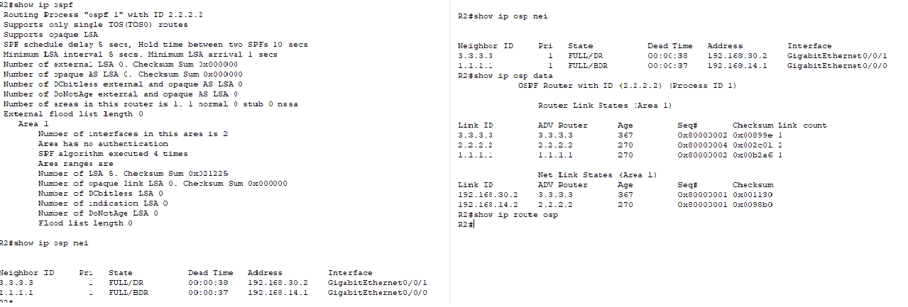
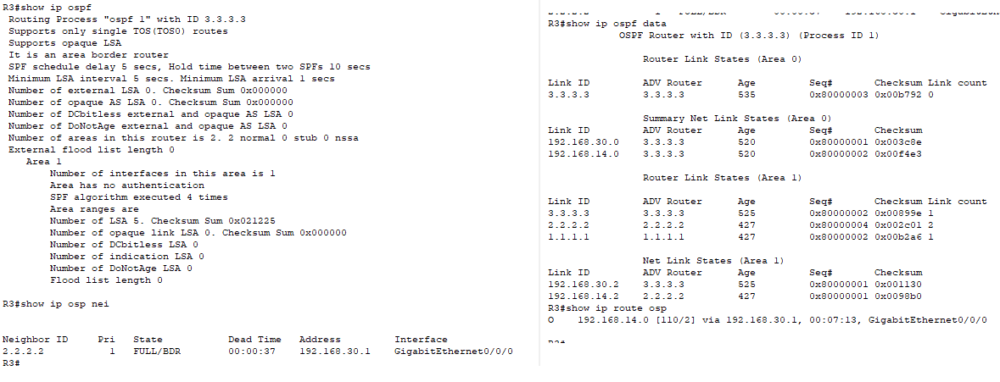
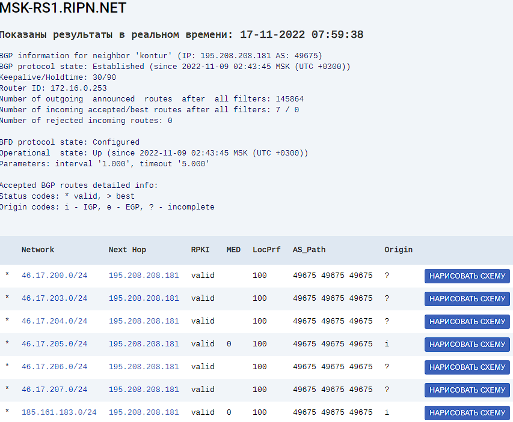

# Домашнее задание к занятию "Отсутствие связности: диагностика и устранение"
 
---

### Лабораторная работа "Применение инструментов для диагностики случаев при отсутствии связности сети"

 ### Задание 1. 
 
Кейс: топология сети на картинке. 
Для построения сети воспользуйтесь Cisco Packet Tracer.
 


Необходимо:
1) настроить маршрутизаторы, используя сетевые настройки, указанные на картинке. Маршрутизация статическая
2) выполнить команду ping между R1 и R3. Результат зафиксировать скриншотом
3) добиться прохождения ping между R1 и R3, используя статическую маршрутизацию. Результат зафиксировать скриншотом. В свободной форме объяснить, что вы сделали, чтобы связь между маршрутизаторами появилась.
 
*Результаты выполнения задания оформить в один документ: скриншоты + текст. Так же предоставить файл .pkt*

------



Для данных условий достаточно на R1 и R3 прописать маршрут по умолчанию в сторону R2
```
ip route 0.0.0.0 0.0.0.0 R2
```
[4.8.pkt](./files/4.8.pkt)

### Задание 2.
 
Кейс: топология сети на картинке.

Для построения сети воспользуйтесь Cisco Packet Tracer.


1) Настройте ospf на маршрутизаторах 
2) Сделайте на каждом маршрутизаторе вывод команд:
- show ip ospf
- show ip ospf  neighbor
- show ip ospf  database
- show ip route ospf
3) В чём проблема? 
 
*Вывод команд оформить в виде скриншотов, ответ на 3 в текстовом виде. Всё оформить в один документ. Также предоставить файл .pkt*

------
 
R1   
   
R2   
  
R3   
 

ТАк как изображено на картинке не должнобыть, если R1 и R3 действительно должны быть в магистральной зоне, то между ними надо прокинуть линк. Или же тут три разных Зоны. Возможно R3 это роутер другого провайдера и 2 провайдера объединились в одну сеть, тогда тут все надо перенастроить или кинуть virtual-link c R1 на R3 чтобы создать единую магистральную зону

### Задание 3.
 
1) Найдите в интернете несколько серверов looking glass. В текстовом файле приложите ссылки 
2) Используя [LG](https://www.msk-ix.ru/lookingglass/)
- выберите один из маршрутизаторов "Route-server" 
- с помощью "BGP summary" найдите идентификатор одного из соседей
- с помощью "Neighbor info" найдите информацию о соседе
В ответе прикрепите скриншот вывода информации и в свободной форме опишите, что вы видите в выводе.

   
Отсюда видим адрес присоединения к соседской AS. Так же можно увидеть ести которые анонсирует соседская AS, и то что используется AS path pretend

3) Используя whois сайта nic.ru:
- посмотрите информацию о соседе, которого нашли в пункте 2
 
*В ответе прикрепите скриншот вывода информации и в свободной форме опишите, что вы видите в выводе.*
 
---

Можем увидеть что данные диапозоны адресов принадлежат СКБ Контур, кем выданы, полный диапозон адресов, хотя по маске и так видно, номер AS. И так же видно что это PA-адреса
```
Информация об ip адресе 46.17.207.1
Информация по данным whois.ripe.net
% This is the RIPE Database query service.
% The objects are in RPSL format.
%
% The RIPE Database is subject to Terms and Conditions.
% See http://www.ripe.net/db/support/db-terms-conditions.pdf

% Note: this output has been filtered.
% To receive output for a database update, use the "-B" flag.

% Information related to '46.17.207.0 - 46.17.207.255'

% Abuse contact for '46.17.207.0 - 46.17.207.255' is 'abuse-noc@skbkontur.ru'

inetnum: 46.17.207.0 - 46.17.207.255
netname: SKBKONTUR
geoloc: 55.76266790754866 37.6226806640625
descr: CSJC Production Company "SKB Kontur"
descr: colo
country: RU
org: ORG-zpsk1-RIPE
admin-c: NO962-RIPE
tech-c: NO962-RIPE
status: ASSIGNED PA
mnt-by: NO9784-MNT
mnt-domains: NO9784-MNT
created: 2011-10-26T12:47:18Z
last-modified: 2017-06-22T06:53:49Z
source: RIPE # Filtered

% Information related to '46.17.207.0/24AS49675'

route: 46.17.207.0/24
descr: SKBKONTUR-DC207
origin: AS49675
mnt-by: NO9784-MNT
created: 2011-10-26T12:48:41Z
last-modified: 2012-11-23T08:14:24Z
source: RIPE

% This query was served by the RIPE Database Query Service version 1.104 (WAGYU)
```
 