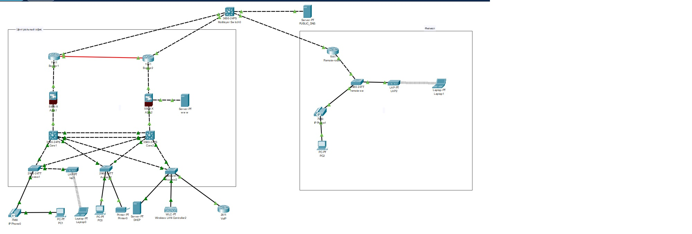
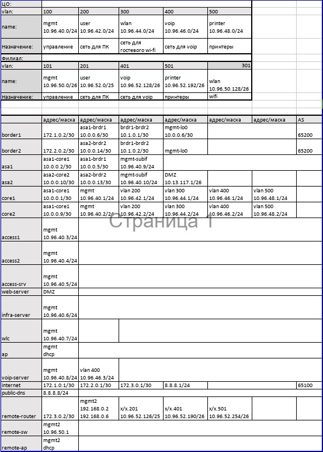
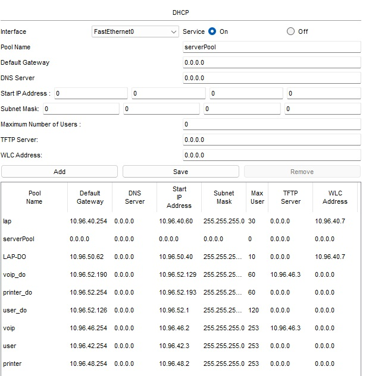
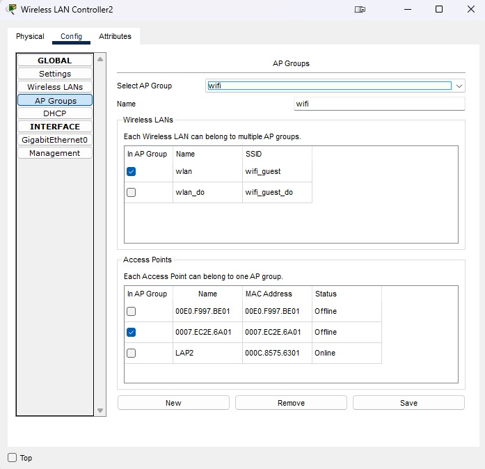
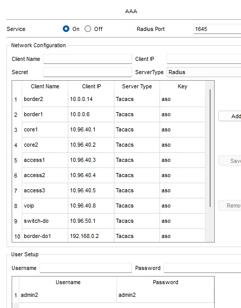
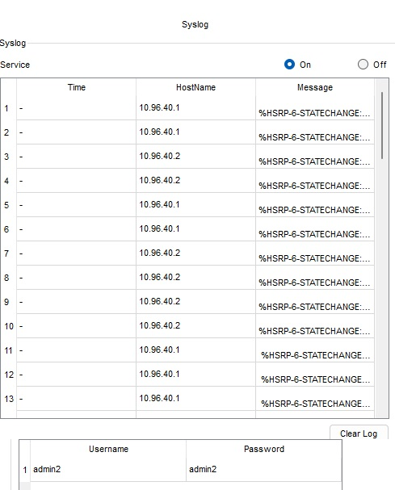

# Дипломная работа по курсу «Сетевой инженер»

## Студент: Литовка Иван Васильевич

* [Цель дипломной работы](#цель-дипломной-работы)
* [Чек-лист готовности к выполнению  дипломной работы](#чек-лист-готовности-к-выполнению-дипломной-работы)
* [Задание](#задание)
* [Этапы выполнения](#этапы-выполнения) 
* [Тестирование](#тестирование) 
* [Правила приема дипломной работы](#правила-приема-дипломной-работы)
* [Критерии оценки дипломной работы](#критерии-оценки-дипломной-работы)

### Цель дипломной работы
 

Построение хорошо масштабируемой отказоустойчивой и защищённой сети, выделяя для каждого пользовательского сервиса уникальные права и пропускную полосу. Объединение разрозненных филиальных сетий компании в одну единую. Настройка централизованной аутентификации и логирования в настроенной сети. 

1. Настроить отказоустойчивую связку RSTP+HSRP на уровне доступ-ядро.
2. Подготовить безопасное централизованное назначение сетевых настроек для оконечных устройств.
3. Организовать централизованный беспроводной гостевой доступ к сети интернет.
4. Организовать отказоустойчивую маршрутизацию в сети компании.
5. Организовать отказоустойчивый доступ к сети интернет по протоколу BGP.
6. Развернуть сервис VoIP внутри компании.
7. Настроить сервисы централизованной аутентификации, синхронизации времени и логирования сетевых устройств.
8. Настроить сеть компании полностью "под ключ".

### Чек-лист готовности к выполнению дипломной работы

Для выполнения работ потребуется:

1. Понимание протоколов маршрутизации eBGP, OSPF.
2. Понимание предсказуемного поведения протоколов RSTP, HSRP, LAG.
3. Знание протоколов безопасного подключения к уровню доступа (vlan, trunk, portfast, bpduguard, dhcp-snooping)
4. Умение настраивать туннельный протокол GRE.
5. Умение настраивать Qos для голосового трафика внутри GRE.
6. Знание aaa, tacacs+, NTP, syslog.
7. Умение настраивать устройства беспроводной сети: AP, WLC.
8. Умение настраивать внутреннюю voip-телефонию.
9. Знание особенностей настройки межсетевого экранирования на Cisco ASA.
10. Умение настраивать static NAT, PAT overload. 

------

### Инструменты и дополнительные материалы, используемые в работе

Для выполнеия работы использовалось ПО Cisco PAcket Tracer 8.2.0   
Файл рабочего проекта: [work.pkt](./files/work.pkt)   
Файл с адресацие сетей: [ip-address-table.xlsx](./files/ip-address-table.xlsx)   
Списки ACL на коммутаторах ядра и удаленном маршрутизаторе: [acl.docx](./files/acl.docx)   

------

## Выполнение задание

### Этапы выполнения

1) Соберите топологию сети в Cisco Packet tracer. 

Сеть построена из предложенного заданием оборудования и топологии.   

2) Заполните [таблицу распределения подсетей и адресов](https://github.com/netology-code/ntw-diplom/blob/main/ip-address-table.xlsx) (по примеру коммутатора "internet"). 

3) Настройте на коммутаторах доступа порты для подключения пользовательских устройств и аплинки. Также на пользовательских портах коммутатора следует настроить: 
     * port-security на 2 адреса, 
     * dhcp-snooping, 
     * portfast, 
     * RSTP.

Настройки выполнены  

  
4) Настройте на коммутаторах ядра: 
     * vlan, 
     * LAG, 
     * RSTP, 
     * SVI,
     * dhcp-relay 
     * HSRP для всех vlan.  
  
Настройки выполнены

5) Настройте сервисы для распределения сетевых настроек для пользовательских устройств. Так как сервер находится в отдельной сети, на SVI настраивается helper. По окончанию настроек dhcp-сервер должен раздать настройки PC, телефонам и принтерам, с любого хоста ЦО должен быть доступен любой другой хост.  

Настроен сервер DHCP   

6) Настройте сервис БЛВС. Точки доступа должны подключаться к контроллеру, который сообщит им настройки по capwap. Подключите ноутбук к ТД, проверьте связность сети.

Настроен WLC

   
В процессе выполнения дипломной работы в Центральном офисе точка доступа перестала отображать информацию о подключении к WLC, при этом беспроводное устройсто подключается к Wi-Fi сети и получает все необходимые настройки.  
Еще одна проблема с которой столкнулся, в определенный момент перестали проходить DHCP запросы с точки доступа и беспроводного устройста через порт коммутатора Access1 при анализе отброшенного пакета CPT указывал комментарий что пакет дропает протокол STP. На порту был отключен portfast и все что могло быть связано с этим, проблема не была решена. В связи с вышеуказанным было принято решение отключить на коммутаторе проткол STP для VLAN100, 300.

7) На коммутаторах ядра запустите протокол маршрутизации ospf. Он должен анонсировать все внутренние сети в зоне 1.

Оборудование настроенно в соответствии с заданием. Была проблема при анонсировании с двух бордеров маршрута по умолчанию, маршрутизация OSPF привратилась в хаос петель маршрутизации, после определения Area1 как тупиковой зоны (stub) проблема ушла. Единственная петля которая осталась на ASA1 для маршрута к веб-сервреру в DMZ через бордер1 (как от нее избавиться решение не найдено, по идеи в ospf такого не должно было случиться), но при работающем бордере2 данная проблема не является проблемой, т.к. маршруты от вебсервера идут через него во вне, а доступ из вне к веб серверу настроет на бордере2 через static nat.

8) На каждом межсетевом экране настройте адресацию и три зоны: inside, outside, DMZ.  
   
   Правила фильтрации:
   * из inside доступ свободный во все зоны
   * из outside в inside и DMZ доступ разрешен для траффика от приватных адресов
   * из DMZ разрешен доступ только в outside на публичные адреса

Настройки выполнены

9) На Cisco ASA настройте протокол ospf. МСЭ должен принимать и анонсировать все сети в зоне 1.  
   Настройте web-сервер, подключенный в DMZ зону одной из ASA.  

   На этом шаге проверьте:  
   * все ли сети получены
   * все ли сети анонсируются на коммутаторы ядра
   * есть ли доступ к web-серверу и с него

Настройки выполнены
   
10) Настройте пограничные маршрутизаторы. Настройте адресацию и проверьте сетевую связность внутри ЛВС и доступность шлюза провайдера. 

11) Настройте маршрутизацию ospf: 
 * интерфейсы в сторону ASA в зоне 1 
 * между собой в зоне 0   
 
   Настройте анонс маршрута 0.0.0.0/0 во внутреннюю сеть с разными метриками для резервирования подключения. Другие маршруты с бордеров во внутреннюю сеть не должны анонсироваться. Проверьте получение и анонс маршрутов.  
  
Настройки выполнены

12) Настройте ebgp-сессии с оборудованием провайдера. Проверьте получение и анонс маршрутов. 

Настройки выполнены

13) Настройте правила NAT,PAT на пограничных маршрутизаторах.

Настройки выполнены

14) Настройте маршрутизатор филиала: адресацию, статический маршрут до роутеров ЦО через провайдера. Проверьте связность с внешними интерфейсами бордеров ЦО.  

Настройки выполнены

15) На маршрутизаторе филиала настройте Tunnel-интерфейсы gre до бордеров ЦО. А так же протокол ospf для получения и анонса внутренних сетей. Туннельные интерфейсы  в зоне 2.  

Даный настройки в CPT работают не корректно, при анонсе маршрутов в ospf через тунель мы получаем ошибку рекурсивный маршрут, после чего через некоторое время процесс ospf на роутере филиала уходит в бесконечную загрузку информации ospf, информация грузится каждую секунду. Из открытых источников данную проблему можено решить использованием в тунеле адрессации /32, но это работает только на живом оборудовании. Из обсуждения данной проблемы с другими студентами, а так же комментариев преподователей в вопроса-ответах к дипломному заданию было принтято решение использовать статическую маршрутизацию при соединении центрального офиса и филиала.

16) Настройте коммутатор доступа филиала для подключения к сети ip-телефона, ПК и точки доступа. На маршрутизаторе настройте helper для централизованного получения сетевых настроек оконечными устройствами. 

Настройки выполнены.

17) Настройте БЛВС ТД филиала, подключить к ней ноутбук. Проверьте сетевую связность.

Настройки выполнены. В задании не указано, но для Wi-Fi сети филиала был создан отдельный VLAN.

18) Настройте на АСО интерфейсы для управления. Настройте на них аутентификацию по tacacs+ и отправку логов по syslog(на ASA настройка aaa и syslog не требуется, достаточно локальной учётной записи). 

Настройки выполнены, все оборудование за исключением ASA подключены к серверу TACAS+ и SYSLOG   
   
  

19) Настройте ip-телефоны, проверьте дозвон.

Настройки выполнены. 

Кратко опишите, чем чреват выбор протокола GRE для объединения сети ЦО и филиала в 15 пункте. Какие более безопасные альтернативы можно предложить без потери функциональности?

Ипользование GRE чреват утечкой данных, т.к. данные в таком тунеле передаются в открытом виде и не подвергаются шифровании. Для более защищенной передачи данных необходимо использовать тунель с использованием протокола IPsec или других вариантов с использованием шифровании. На собственной практике при объединении филиалов с центральным офисом используем оборудование от Infotec VipNET.

### Тестирование

1) Проверка STP, HSRP. Роль Root bridge и HSRP-active на одном устройстве. Команды: show spanning-tree, show standby на этом устройстве.
2) Проверка маршрутизации на коммутаторах ядра. Show ip route. Должен присутствовать маршрут по-умолчанию и маршруты до интерфейсов ASA и бордеров.
3) Проверка LAG на бордерах show etherchannel summary.
4) Маршрутизация на бордерах sh ip route. В таблице маршрутизации должны присутствовать bgp-маршруты от провайдера, ospf-маршруты до внутренних подсетей ЦО и филиала.
5) Туннель CAPWAP на БЛВС ТД в статусе Connected, с ноутбуков есть связь с 8.8.8.8.
6) Телефонные аппараты зарегестрированы на VoIP сервере, прозвон с одного на другой работает.
7) На все сетевые устройства можно попасть по учётной записи tacacs+ сервера.
8) Время на устройствах синхронизировано. Show ntp status.
9) С 8.8.8.8 есть доступ к web-серверу в DMZ. Обратный доступ тоже есть. Проверять доступ необходимо браузером.
10) Отключение одного из каналов связи не приводит к потере доступа в интернет с пользовательских ПК(ping до сервера 8.8.8.8). 
11) Выход из строя одного из коммутаторов ядра, межсетевого экрана или бордер роутера не приводит к потере доступа в интернет с пользовательских ПК(ping до сервера 8.8.8.8). Потеря доступа к web-серверу извне доспускается.
12) Ноутбуки не имеют доступа к внутренним сетям компании(ping svi users, mgmt, printer).
13) Устройства филиала имеют доступ только к внутренним сетям компании, не имеют выхода в интернет.

ПРИМЕЧАНИЕ. В связи с особенностью эмулятора Packet Tracer, часто бывает так, что для того, чтобы тест заработал, нужно перезагрузить устройства.

------

### Правила приема дипломной работы

В качестве выполненной работы прикрепите в личном кабинете файлы, содержащие следующую информацию:
* Пояснительную записку, которая содержит таблицы и описания к решениям, указанным на всех этапах выполнения работ. Обоснование предполагает короткое описание (1-3 предложения) выбранного технического решения, которое должно ответить на вопрос, почему вы выбрали именно это решение, а не иное. 
* Собранную топологию в PacketTracer в виде. pkt файла.
* Конфигурационные файлы с оборудования.
* Результаты тестирования, проведенного на шаге "Тестирование", в виде отдельного текстового файла с вложенными в него скриншотами и трассировками.

### Критерии оценки проекта

1. Зачёт:
   - Топология построена корректно.
   - Адреса и подсети распределены с учётом размера сети и возможного масштабирования. 
   - Все тесты пройдены успешно.
   
   Допускается не более 3 ошибок в тестах и двух ошибок выделении подстетей.
   
2. Незачёт:

   - Ошибки в выделении адресов, подсетей и масок, более трёх тестов не пройдено.
