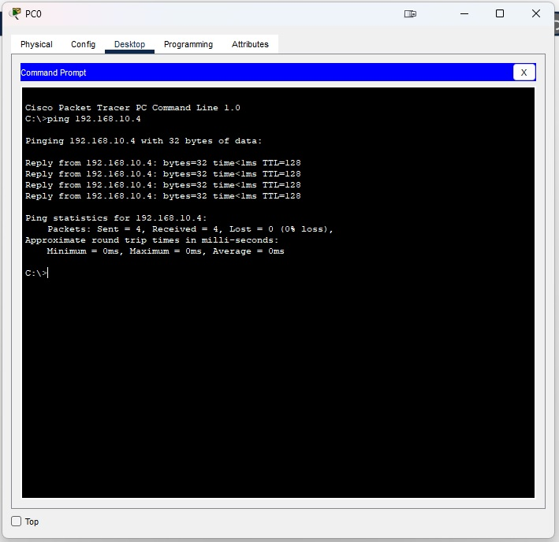

# Домашнее задание к занятию "Основы работы с телефонией Cisco"

### Цель задания

В результате выполнения задания вы научитесь делать первичные настройки IP-телефонии на устройствах производителя Cisco.

------
 
### Задание 1. Лабораторная работа "Настройка IP-телефонии в сети простой конфигурации"

1. В Cisco Packet Tracer собрать сеть согласно топологии на картинке ниже.

2. Список VLAN:
* VLAN 10 - DATA
* VLAN 20 - VOICE
* VLAN 30 - MANAGEMENT

3. Настроить коммутатор:
- Добавить VLAN'ы
- Прописать IP для управления - 192.168.20.2/24
- Порт Fa0/1 - trunk, Fa0/2-Fa0/4 - access vlan 10 + voice vlan 20

4. Настроить маршрутизатор на работу по протоколу SCCP:
- Использовать сабинтерфейсы в соответствующих VLAN'ах. IP-адреса - 192.168.10.1/24, 192.168.20.1/24, 192.168.30.1/24
- Поднять DHCP серверы в vlan 10 и 20. DHCP во vlan 20 использует option 150, который указывает на себя же (192.168.20.1)
- В разделе telephony-service указать source (192.168.20.1)
- Создать номера 1010, 1020, 1030
- Прописать номера на соответствующих аппаратах

5. Провести тестовый звонок с телефона 1010 на 1030, убедиться что всё работает.

6. Провести ping с компьютера PC0 на PC2

*В качестве ответа приложите файл .pkt и скриншоты ping'а из п.6* 

------
[10.3.pkt](./files/10.3.pkt)   

### Задание 2

Как вы думаете, для чего нужен Voice VLAN и что будет, если его не использовать?

*Приведите ответ в свободной форме*

------
Скорее всего чтобы изолировать голосовой трафик из общего потока и широковещательных рассылок, так же с ним проще будет работать по улучшению качества передачи голосовых данных используя QoS. Отсутствие VoiceVLAN может привести например к перехвату голосовых пакетов из общего потока данныйх при помощи wireshark или прочего ПО.