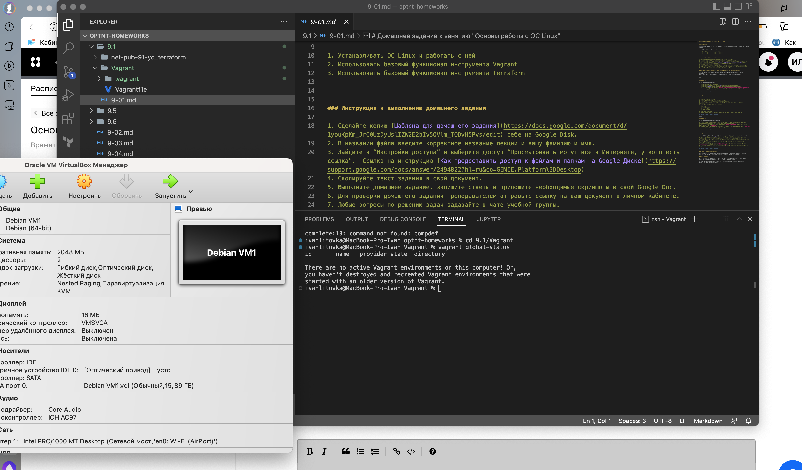
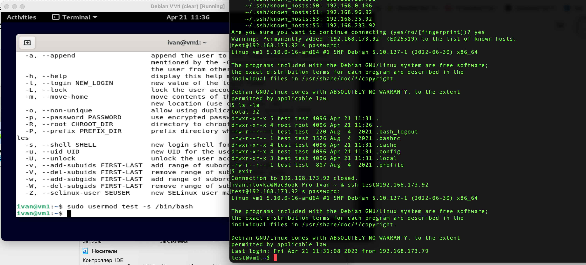
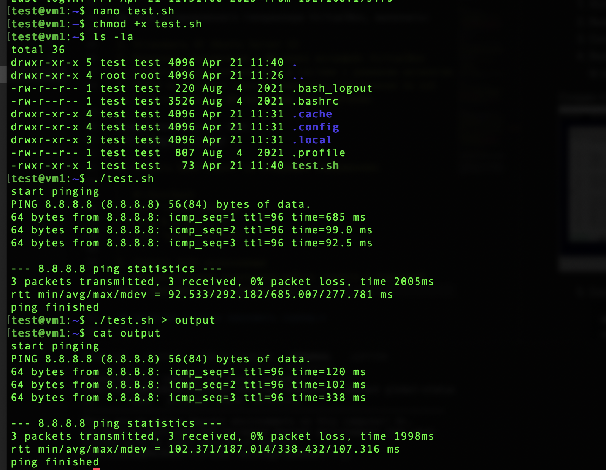
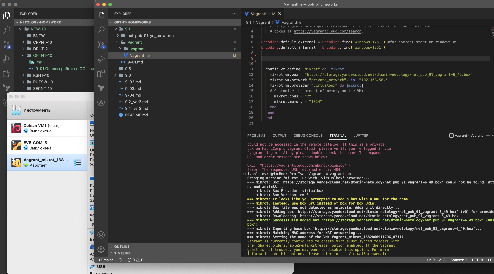

# Домашнее задание к занятию "Основы работы с ОС Linux"


### Цель задания

Данное домашнее задание позволит вам разобраться в подходах IaC и в дальнейшем автоматизировать ручные операции.

В результате выполнения задания вы научитесь:  

1. Устанавливать ОС Linux и работать с ней
2. Использовать базовый функционал инструмента Vagrant
3. Использовать базовый функционал инструмента Terraform


### Инструменты/дополнительные материалы, которые пригодятся для выполнения задания

Материалы занятия "Настройка виртуального рабочего места" помогут вам установить и настроить VirtualBox.  
Занятие можно найти в личном кабинете в модуле "IT-системы и Linux (с самопроверкой)". 


---


### Задание 1. 

На хост машине Windows выполнить:

   1. Установить гипервизор VirtualBox
   2. Установить систему контроля версий [Git](https://git-scm.com/download/win)
   3. Установить [Vagrant](https://hashicorp-releases.yandexcloud.net/vagrant/2.3.4/)
   4. Открыть Git, в консоли выполнить: `git clone https://github.com/netology-code/optnt-homeworks.git`
   5. Перейти в созданную директорию проекта, затем перейти в /9.1/Vagrant/ и выполнить `vagrant global-status`, приложить скрин.
 
*В качестве ответов приложить скрины.*


------

### Задание 2. 


На базе установленного гипервизора VirtualBox, выполнить:

1. Установить ОС Ubuntu Server 22
2. Выполнить подключение к ВМ через интерфейс VirtualBox
3. Создать нового пользователя в системе с домашним каталогом
4. Выйти из текущего сеанса и выполнить подключение по ssh на ip установленной ВМ под новым пользователем

Создан пользователь test   


5. Создать bash скрипт со следующим содержанием:
    ```
   #!/bin/bash  
   echo "start pinging"  
   ping 8.8.8.8 -c 3  
   echo "ping finished"
   ```
6. Сделать файл исполняемым
7. Направить вывод результата работы скрипта в отдельный файл. Приложить скрин результата.


     
*В качестве ответов приложить скрины.*

------

### Задание 3.

На хост машине Windows выполнить следующее:

1. Открыть ранее установленный Git в режиме консоли, перейти в ранее склонированный репозиторий(/optnt-homeworks/9.1/Vagrant) в котором лежит подготовленный Vagrantfile.
2. Посмотреть возможно запущенные ВМ на базе Vagrant: `vagrant global-status` и если пусто, выполнить запуск текущего проекта `vagrant up`.   
3. После завершения процесса запуска, подключиться к ВМ ubuntu средствами Vagrant и выполнить `curl 2ip.ru`, ответ должен быть 51.250.97.135. Приложить скрин.    

Без ВПН этого не сделать, т.к. бесплатного ВПн с нормальной скоростью у меня нету, ту часть вагрант-файла где описывается развертывание ВМ Убунту удалил. Машина с микротиком развернулась нормально.


*В качестве ответов приложить скрины.*


