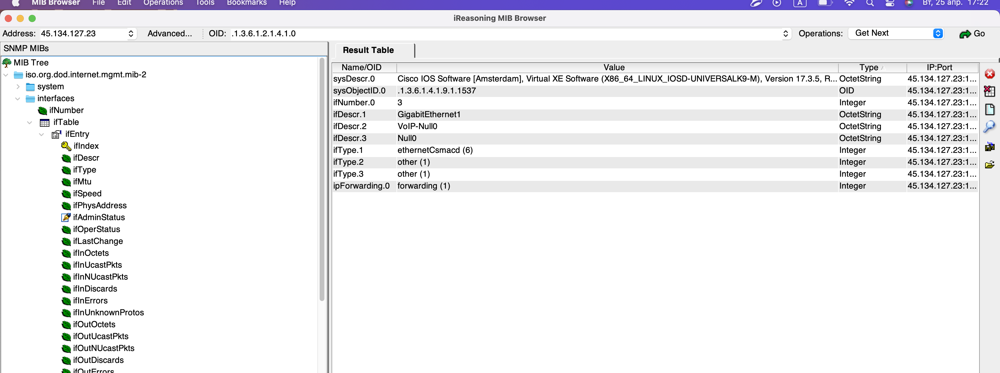
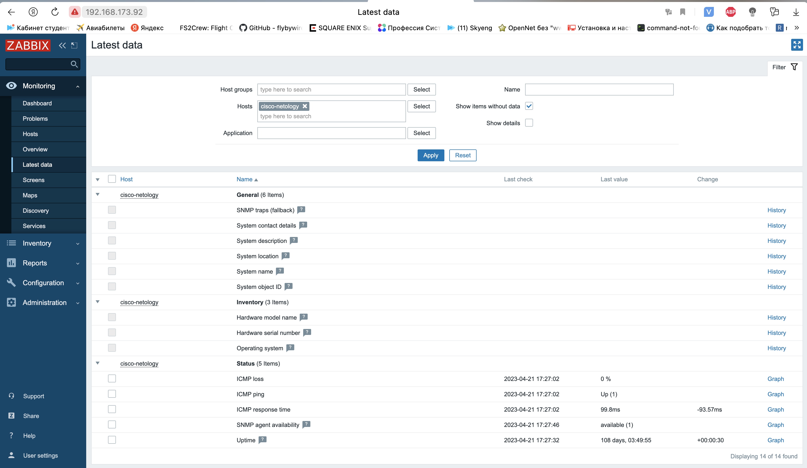

# Домашнее задание к занятию "Мониторинг сетевых устройств. SNMP и SNMP Trap"

### Цель задания

В результате выполнения задания вы научитесь:  

1. Конфигурировать сетевые устройства для приема запросов от SNMP сервера.
2. Настраивать систему мониторинга Zabbix для опроса сетевых устройств по протоколу SNMP.

------

### Инструменты/ дополнительные материалы, которые пригодятся для выполнения задания

Доступ к виртуальному маршрутизатору Cisco CSR по ssh:   
IP: 45.134.127.23   
Логин: netology_student    
Пароль: iamanetworkengineer!23   

---

### Задание 1 

1. Установите программу iReasoning MIB Browser (или аналогичную) на свой ПК.   
2. С помощью snmpwalk запросите все доступные данные у хоста:     
IP: 45.134.127.23   
SNMP READ Community: netology_snmp    

*Решение отправьте в виде скриншота, где будет видна часть полученных данных от опрашиваемого хоста*

------

### Задание 2 

1. Установите Zabbix на виртуальную машину.  
  
2. Добавьте хост для мониторинга со следующими параметрами:  
Имя: netology_csr   
Адрес SNMP: 45.134.127.23   
SNMP Community: netology_snmp    

3. Прикрепите к хосту встроенный в заббикс шаблон Cisco IOS versions 12.0._3_T-12.2_3.5 by SNMP.

4. Подождите 2 минуты и перейдите в Latest data по хосту netology_csr.

*Решение отправьте в виде скриншота, где будут видны полученные данные от netology_csr*

