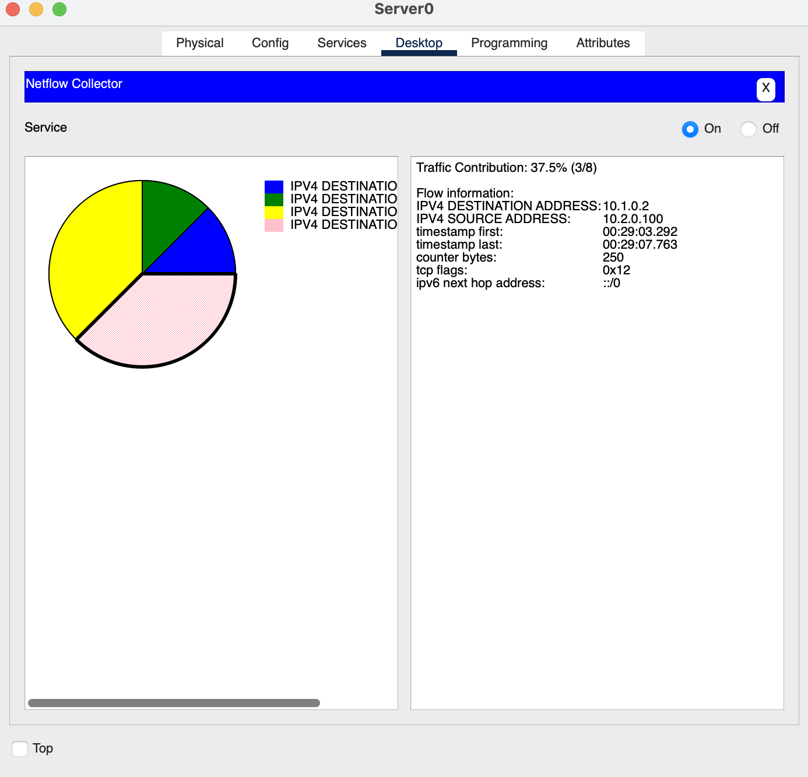
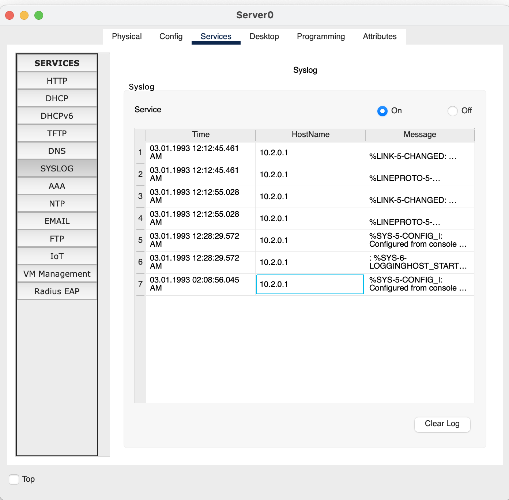

# Домашнее задание к занятию "Сбор и учет данных (NetFlow, syslog)"


### Цель задания

В результате выполнения задания вы научитесь:  

1. Настраивать отправку логов с оборудования
2. Настраивать отправку статистики NetFlow с оборудования
3. Анализировать NetFlow статистику

------


### Задание 1. 

Сконфигурировать NetFlow на маршрутизаторе для отправки данных на сервер. 

NetFlow должен собирать следующие параметры из трафика: 
- Source/Destination IP
- ToS byte, tcp flags
- next-hop 

IP адресация произвольная. 

Запустите пинги и телнеты на разные порты между двумя компьютерами.

*Пришлите конфигурацию маршрутизатора и скрины NetFlow коллектора*

```
Current configuration : 1201 bytes
!
version 15.1
service timestamps log datetime msec
no service timestamps debug datetime msec
no service password-encryption
!
hostname Router
!
ip cef
no ipv6 cef
!
flow exporter HW_EXP
 destination 10.2.0.100
 source GigabitEthernet0/1
 transport udp 9996
!
flow record HW_REC
 match ipv4 destination address
 match ipv4 source address
 collect timestamp sys-uptime first
 collect timestamp sys-uptime last
 collect counter bytes
 collect transport tcp flags
 collect routing next-hop address ipv6
!
flow monitor HW_MON
 record HW_REC
 exporter HW_EXP
!
license udi pid CISCO2911/K9 sn FTX15247B9W-
!
!
spanning-tree mode pvst
!
interface GigabitEthernet0/0
 ip flow monitor HW_MON output
 ip flow monitor HW_MON input
 ip address 10.1.0.1 255.255.255.0

```  

------

### Задание 2. 

Сконфигурировать Syslog на маршрутизаторе для отправки данных на сервер.  

Выключите gi0/1 на интерфейсе маршрутизатора и получите syslog сообщение на сервере.

*Пришлите конфигурацию маршрутизатора и скрины полученных логов*

------

```
logging trap debugging
logging 10.2.0.100
```
