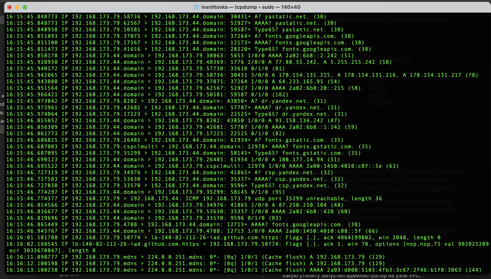

# Домашнее задание к занятию "Сбор и анализ сетевого трафика"

### Цель задания

В результате выполнения этого задания вы получите практический опыт настройки зеркалирования трафика, осуществите сбор данных с помощью tcpdump, а также проанализируете содержимое уже собранных данных в Wireshark с целью выявлению потенциальных причин неработоспособности сети.

------

## Лабораторная работа "Сбор и анализ сетевого трафика"

### Задание 1

1. В программе Cisco Packet Tracer составьте сеть из двух коммутаторов и компьютеров
2. Выделите на коммутаторе отдельный порт, подключите в него сниффер (можно найти в End Devices)
3. Настройте на коммутаторе SPAN, выполните команду show monitor

*Пришлите вывод команды show monitor и полученный .pkt файл*
```
Switch#show monitor 
Session 1
---------
Type                   : Local Session
Description            : -
Source Ports           : 
    Both               : Fa0/2
Destination Ports      : Fa0/3
    Encapsulation      : Native
          Ingress      : Disabled


Switch#
```   
[9.6.pkt](./files/9.6.pkt)


------ 

### Задание 2

На VM Linux (организована в рамках ДЗ к 9.1) установите (с помощью команды "sudo sudo apt-get install tcpdump")и запустите утилиту tcpdump и захватите трафик на любом из доступных интерфейсов. 

P.S. Если VM Linux нет, то можно попробовать выполнить данное задание на любой системе, поддерживающей tcpdump (на любой Unix-based ОС: Linux, OpenBSD,Mac OS и т.д)


*Пришлите скриншот. Ответьте в свободной форме: чем отличается вывод утилиты с флагом -n от вывода без данного флага?* 

------

С флагом -n в выводе небудет конвертации ip адреса в доменное имя   



### Задание 3

По содержимому дампа трафика ([файл DRUT_9.6.3.pcap](https://github.com/netology-code/optnt-homeworks/blob/main/9.6/DRUT_9.6.3.pcapng)) определите, какую утилиту запустил администратор на узле VPC. 

Анализ провести по пакетам с номерами от 24 до 47 включительно.


*Пришлите ответ в свободной форме*

 В пакетах  UDP видно увеличение TTL на единицу с каждым пакетом, а в ответе ICMP TTL exceeded можно сделать вывод что идет работа утилиты tracert/traceroute/trace

------

### Задание 4

Вы – сетевой инженер. К вам приходит коллега, который только устроился на работу с просьбой постараться найти причину того, почему с некоторыми параметрами PING между 192.168.0.254 и 192.168.1.254 проходит, а с некоторыми нет (для удобства можно использовать схему из задания 3). 

Доступа к сетевому сегменту в данный момент нет (коллега тренировался в лаборатории и уже разобрал стенд), но есть дамп трафика с ICMP-пакетами ([файл DRUT_9.6.4.pcap](https://github.com/netology-code/optnt-homeworks/blob/main/9.6/DRUT_9.6.4.pcapng)). 

В дампе вы видите, что на каждый icmp-запрос приходит ответ, но на пакет под номером 7 ответ не пришел. Почему? Предположите, в чем может быть проблема?

*Пришлите ответ в свободной форме*

Возможно проблема в размере пакета, он превышает MTU

------

### Задание 5* 

Во время очередного аудита сетевых каналов вы обращаете внимание, что уже достаточно давно не работает BGP-сессия между маршрутизаторами R10 и R11: 


Проанализируйте дамп трафика ([файл DRUT_9.6.5.pcap](https://github.com/netology-code/optnt-homeworks/blob/main/9.6/DRUT_9.6.5.pcapng)) и предположите, в чем может быть причина того, что сессия BGP не поднимается? Каковы ваши рекомендации по устранению проблемы?

*Пришлите ответ в свободной форме*

надо проверить настроенное соседство на 192.168.0.10 для 192.168.0.11 так как 10 сообщает ошибку Bad peer.

show bgp neib надо глянуть и в BGP прописать
```
neighbor 192.168.0.11 remote-as 11
````

------
остатки.