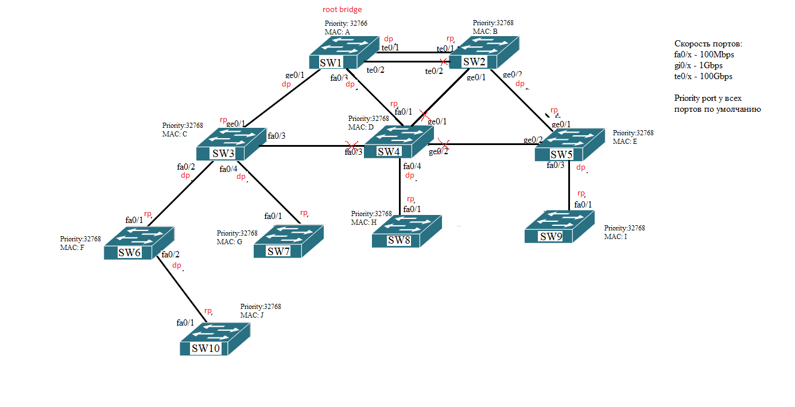

# Домашнее задание к занятию  "Протоколы связующего дерева"
------

### Задание 1.

Для  заданной схемы сети определите:
1) Корневой коммутатор
2) Корневые порты
3) Назначенный порты
4) Неназначенные порты 
 
Обоснуйте своё решение.  
В результате необходимо получить древовидную топологию сети во главе с корневым коммутатором. То есть определить, какие порты будут заблокированны, а какие будут пропускать трафик.  

*Приведите ответ в виде картинки со схемой (внесите изменения) или в виде таблицы. Обоснование в свободной форме.*
---

Выбор root port и designated port исходи из возможной совокупности параметров: приоритета, номера порта, и его стоимости.

### Задание 2.

Определите, что нужно изменить в настройках STP, чтобы на схеме из задания 1 изменился корневой коммутатор?  
Как изменится при этом топология?

В результате необходимо получить древовидную топологию сети во главе с корневым коммутатором. То есть определить, какие порты будут заблокированны, а какие будут пропускать трафик.  
---

Можно заблокировать порты на SW1 te0/1-2 тогда измениться топология сети и начнется повторное согласование root bridge который будет в пользу SW2.

### Задание 3.
Опишите этапы алгоритма RSTP для сети, топология которой изменилась. По аналогии с описанием для STP на слайде № 48 презентации к лекции.
*Приведите ответ в свободной форме.*
---
●Алгоритм STP:
-роли портов определены
-определено, какой порт заблокирован, а какой нет: blocking либо forwarding состояния
-топология сложилась, трафик идёт по сети без возникновения петель
●Происходят изменения в топологии сети
●Коммутатор SW2 перестал получать BPDU от корневого коммутатора
●Коммутатор отправляет TNC BPDU корневому коммутатору SW1
●Корневой коммутатор отправляет всем коммутаторам сети TNC BPDU
●Начинается алгоритм STP
