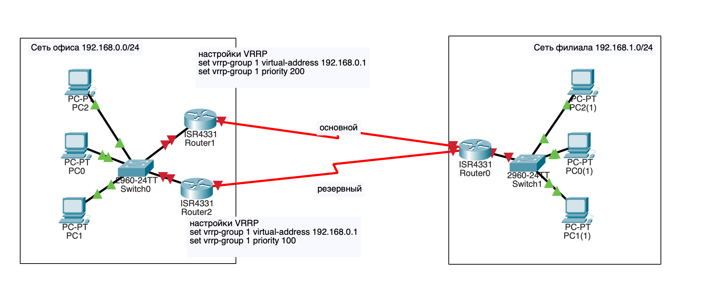
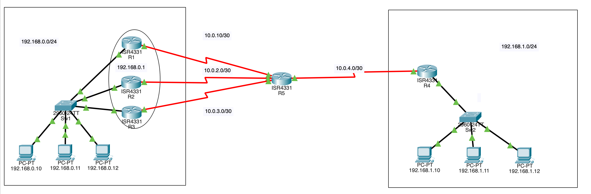

# Домашнее задание к занятию "Протоколы FHRP"

------

### Кейс

У вашей компании есть центральный офис и филиал. В центральном офисе коммутатор и два маршрутизатора. В филиале один коммутатор и один маршрутизатор.
До филиала построено два канала L3. Один канал основной и второй канал - резервный. 
Резервный канал - дорогой, оплата по количеству трафика, пользоваться им необходимо по возможности реже. 
При этом необходимо автоматическое переключение в случае отказа основного канала и возврат в исходное состояние при восстановлении связи.
Сеть офиса - 192.168.0.0/24
Сеть филиала - 192.168.1.0/24
Основной канал - 10.0.1.0/30
Резервный канал - 10.0.2.0/30

### Задание 1

Уточнение - оборудование __Juniper__

1. Выбрать протокол из семейтсва FHRP и обосновать свой выбор.
2. Нарисовать схему сети.
3. Настроить маршрутизаторы центрального офиса в соответствии с выбранным протоколом.

*Ответы на вопрос 1 привести в свободной форме, в текстовом виде.  
 На вопрос 2 - приложить файл в формате .png или .jpg.  
 На вопрос 3 - привести настройки интерфейсов в текстовом виде*

---

Можно настроить VRRP для этих целей, для основного канала увеличить приоретет чтобы роутер стал MASTER.
а вот как настроить отслеживание состояния канала и понижение приоритета роутера вслучае падения основного канала и перевода MAster в BACKUP для Juniper я не нашел.


**Настройки роутеров**
```
Router1
set interfaces ge-0/0/1 unit 0 family inet address 192.168.0.101/24
    set vrrp-group 1 virtual-address 192.168.0.1
    set vrrp-group 1 priority 110
    set vrrp-group 1 track interface ge-0/0/2 priority-cost 20
    set vrrp-group 1 accept-data
set interfaces ge-0/0/2 unit 0 family inet address 10.0.1.1/30
set routing-options static route 0.0.0.0/0 next-hop 10.0.1.2

Router2
set interfaces ge-0/0/1 unit 0 family inet address 192.168.0.102/24
    set vrrp-group 1 virtual-address 192.168.0.1
    set vrrp-group 1 accept-data
set interfaces ge-0/0/2 unit 0 family inet address 10.0.2.1/30
set routing-options static route 0.0.0.0/0 next-hop 10.0.2.2
```

### Задание 2. Лабораторная работа "Выбор и настройка протокола из семейства FHRP"

Компания из кейса, но все оборудование __Cisco__. 

1. Выбрать протокол из семейства FHRP и обосновать свой выбор.
2. Построить топологию в Сisco Packet Tracer. 
3. Настроить оборудование центрального офиса и филиала.
4. Проверить работу резервирования связи с филиалом. Для этого отключить основной канал, проверить командами ping и tracert доступность ПК в филиале и путь до него.

*На вопрос 1 - ответ в свободной форме, в текстовом виде.  
На вопросы 2 и 3 - приложить .pkt файл.  
На вопрос 4 - скриншоты выполнения команд ping и tracert.*

---

Имея два роутера от Cisco для FHRP можно выбрать как VRRP так HSRP, но решение будет в пользу HSRP тюкю этот протокол разработан Cisco для оборудования Cisco и будет использовать его возможности на полную.  
[3.4.2.pkt](./files/3.4.2.pkt)


### Задание 3

Компания та же, но в центральном офисе добавили еще один маршрутизатор. Оборудование __Cisco__.
Адресация для каналов Интернет:
1. 10.1.0.0/30
2. 10.2.0.0/30
3. 10.3.0.0/30

Для имитации сети Интернет можно добавить еще один маршрутизатор, к которому подключить все три канала интернет. 
На этом же маршрутизаторе создать Loopback интерфейс с адресом 10.10.10.10/32 и использовать этот адрес для проверки доступности сети Интернет.

Необходимо обеспечить компании доступ в Интернет. Непрерывно и с балансировкой по трем каналам.

1. Выбрать протокол из семейства FHRP и обосновать свой выбор.
2. Нарисовать схему сети.
3. Настроить маршрутизаторы центрального офиса в соответствии с выбранным протоколом.

*Ответы на вопрос 1 привести в свободной форме, в текстовом виде.  
На вопрос 2 - приложить файл в формате .png или .jpg.  
На вопрос 3 - привести настройки интерфейсов в текстовом виде*


1) Исходя из поставленной задачи логично выбрать протокол glbp от cisco т.к он споксобен не только построить отказустойчивый виртуальный роутер из нескольки физических роутеров, но и балансировать нагрузку.

2)  
  
3) 
```
Router1
int Gi0/0/0
    ip add 192.168.0.101 255.255.255.0
    glbp 1 ip 192.168.0.1
    glbp 1 priority 255
    glbp 1 preemt delay minimum 15
int Ser0/1/0
    ip add 10.0.1.2 255.255.255.252
ip route 0.0.0.0 0.0.0.0 10.0.1.1

Router2
int Gi0/0/0
    ip add 192.168.0.102 255.255.255.0
    glbp 1 ip 192.168.0.1
    glbp 1 priority 90
int Ser0/1/0
    ip add 10.0.2.2 255.255.255.252
ip route 0.0.0.0 0.0.0.0 10.0.2.1

Router3
int Gi0/0/0
    ip add 192.168.0.103 255.255.255.0
    glbp 1 ip 192.168.0.1
    glbp 1 preemt delay minimum 15
int Ser0/1/0
    ip add 10.0.3.2 255.255.255.252
ip route 0.0.0.0 0.0.0.0 10.0.3.1

Router5
int Ser0/1/0
    ip add 10.0.1.1 255.255.255.252
int Ser0/1/1
    ip add 10.0.2.1 255.255.255.252
int Ser0/2/0
    ip add 10.0.3.1 255.255.255.252
int Ser0/2/1
    ip add 10.0.4.1 255.255.255.252
int Lo0
    ip add 10.10.10.10 255.255.255.255
ip route 192.168.0.0 255.255.255.0 10.0.1.2
ip route 192.168.0.0 255.255.255.0 10.0.2.2
ip route 192.168.0.0 255.255.255.0 10.0.3.2
ip route 192.168.1.0 255.255.255.0 10.0.4.2
```
