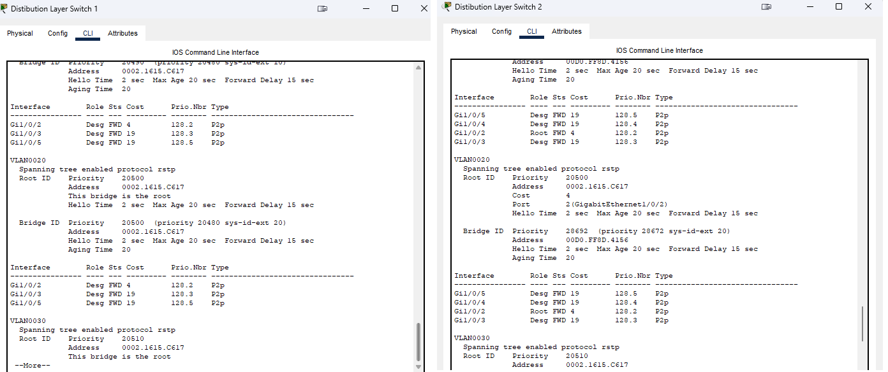
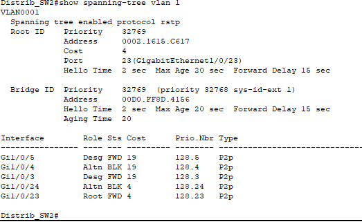
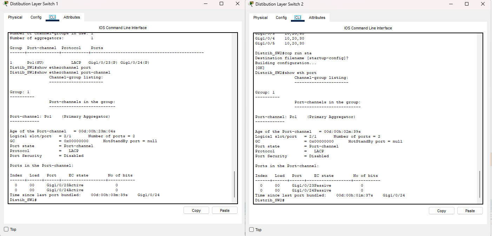
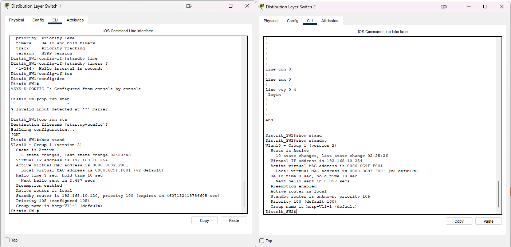
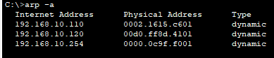
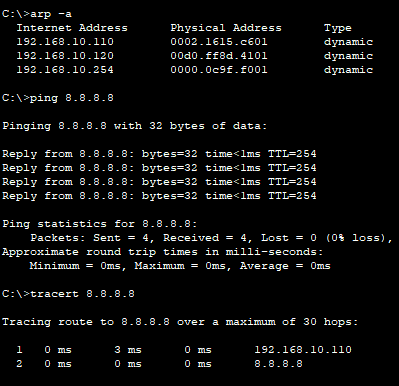

# Домашнее задание к занятию "Построение отказоустойчивых сетей" 

### Цель задания

Выполнив этот блок, вы научитесь управлять протоколом STP. Назначать нужный вам коммутатор основным для передачи IP пакетов. Решите небольшую головоломку с неправильным подключением компьютера к сети. В результате выполнения задания вы:

1. Настроите интерфейсы на всех свитчах согласно схеме.
2. Настроите RSTP, LACP, HSRP согласно заданию.
3. Проведете поиск неисправностей.
### Задание 1. Настройки

0. Пропишите IP адреса на Laptop
- Laptop0 - 192.168.10.10/24
- Laptop1 - 192.168.20.10/24
- Laptop2 - 192.168.10.20/24
**Настроено**

1. Подключить коммутатор Distibution Layer Switch 2 таким образом, чтобы он обеспечивал отказоусточивость для коммутаторов уровня доступа (Access layer sw1-sw3). 
**Подключено**
2. Настроить порты на коммутаторах в соответствии с их ролями. Пользовательские порты в access, между свитчами в режиме trunk.
**Настроено**
3. Поменять STP на Rapid PVST на всей сети.
**Сделано**
4. Назначить Root Bridge  свитч Distrib_SW1 root primary, Distrib_SW2 - root secondary для всех VLAN. Покажите какой Bridge priority у root secondary.
**Настроено**

5. Добавить пару линков между Distrib_SW1 и Distrib_SW2 на портах Fa0/23-0/24. Убедиться, что один из портов перешел в состояние BLK  

6. Собрать между ними LACP (Po1)  зафиксировать, что сейчас оба интерфейса в состоянии FWD. На одном конце подключение должно инициироваться, а на другом - ожидаться.
**СОбрано**

7. Настроить HSRP на портах Fa0/1 между WAN маршрутизаторами для vlan10
- vlan 10 192.168.10.254  
Не забыть указать задержку, если используете опцию preempt.  

В **cpt** нельзя указать **preemt delay**. И тут мне нужна помощь, я не могу понять почему второй роутер не знает об активном ничего, а активный знает о стенбай роутере


---

### Задание 2. Траблуштинг

1. Проверить, какая версия протокола STP запущена и найти Root Bridge.

Можно проверить выполнив **show run** и увидеть
```
spanning-tree mode rapid-pvst
spanning-tree vlan 10,20,30 priority 20480
```
По выводу команды **show spanning-tree** найти какой порт смотрит в сторону **root** и проследовать по нему пока не найдем **root bridge**
```
Interface        Role Sts Cost      Prio.Nbr Type
---------------- ---- --- --------- -------- --------------------------------
Fa0/4            Altn BLK 19        128.4    P2p
Fa0/2            Desg FWD 19        128.2    P2p
Fa0/3            Desg FWD 19        128.3    P2p
Fa0/24           Root FWD 19        128.24   P2p
```
2. Показать на Laptop 1, какая версия HSRP и какой номер группы используется (версию HSRP можно идентифицировать с помощью проверки ARP-таблицы).

Не понимаю как это сделать, мы HSRP настраивали для vlan10, а Laptop 1 в другом vlan20

На LAptop1 виддно по команде arp что версия HSRP 2 из-за mac-адреса


3. Выяснить, через какие линки трафик доходит от Laptop0 до Loopback1 интерфейса WAN Primary. Решить проблему неоптимальной передачи данных, если таковая существует.
Озвучить найденную проблему.

Очень даже оптимально идет


4. Разрешить проблемы с доступностью Laptop1. Laptop1 должен пинговать 4.4.8.8 - Loopback1  интерфейс Backup Маршрутизатора.

Эту проблему я не решил.


Файл домашней работы: [3.6.pkt](./files/3.6.pkt)


### Правила приема домашнего задания

В личном кабинете отправлен pkt файл с выполненным проектом.

### Критерии оценки

Зачет - выполнены все задания, ответы даны в развернутой форме, приложены соответствующие скриншоты и файлы проекта, в выполненных заданиях нет противоречий и нарушения логики.

На доработку - задание выполнено частично или не выполнено, в логике выполнения заданий есть противоречия, существенные недостатки.