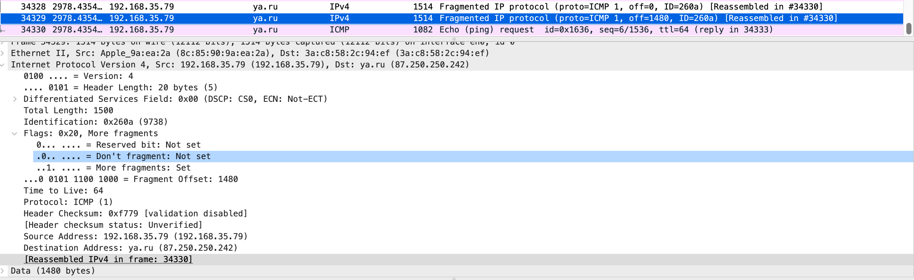
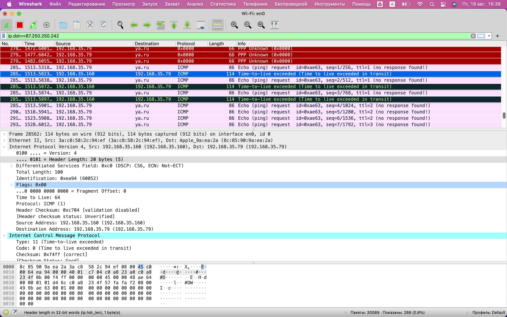
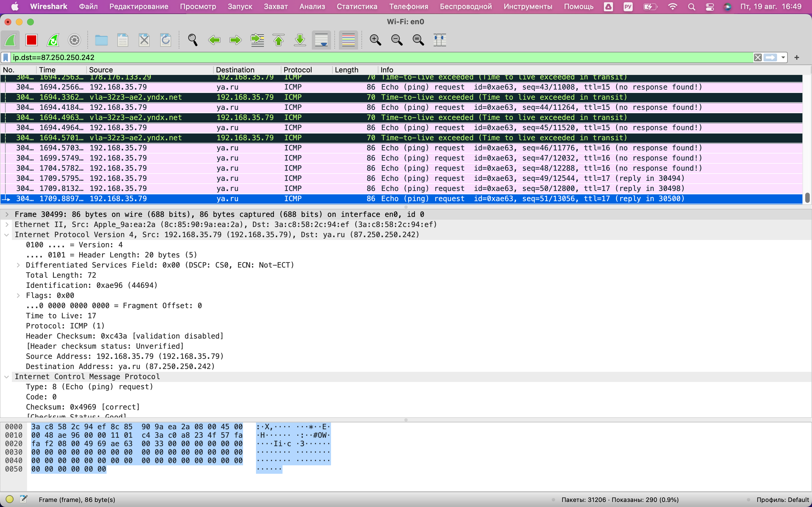
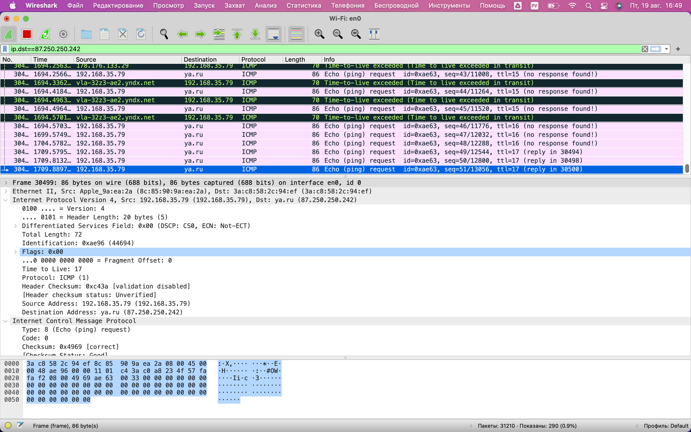

### Задание 1
---

запущен пинг с размером пакета 4000 байт, из скрина видно что пакет разбит на 3 части со смещением 1480 байт, во втором фрагменте 
стоит флаг что следом есть еще один фрагмент.

### Задание 2
---

На скриншоте видно что при трасировке пути до ya.ru получен ответ от первого шлюза (шлюз по умолчанию, мобильный телефон в виде точки 
доступа) что TTL исчерпан и пакет отброшен, а адрес отправителя заменен на адрес точки доступа. Следующий пакет с TTL=2 отправлен 
повторно на ya.ru, но скорее всего из-за настройки всех последующих маршрутизаторов на отбрасывание протокола или пакета малого объема 
ICMP ответы не получены, 
ну и трасировка в целом за пределами ЛВС не удачна. Пробовал делать трасировку с протоколами UDP, TCP, но все было отброшено.

На 17-м прыжке ответ получен, но это уже сам сервер яндекса дал ответ, потому как доступен. Видно что TTL=17

