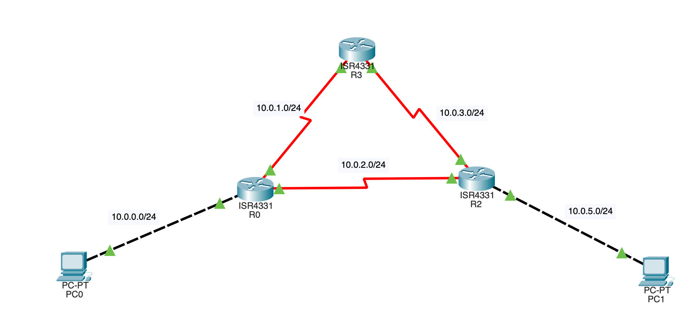

### Задание 1
---
Метрика - это параметр используемый при динамической маршрутизации для определения наилучшего маршрута, может зависить от скорость 
соединений, количиства хопов.

### Задание 2
---
r0
```

     10.0.0.0/8 is variably subnetted, 8 subnets, 2 masks
C       10.0.0.0/24 is directly connected, GigabitEthernet0/0/0
L       10.0.0.1/32 is directly connected, GigabitEthernet0/0/0
C       10.0.1.0/24 is directly connected, Serial0/1/0
L       10.0.1.1/32 is directly connected, Serial0/1/0
C       10.0.2.0/24 is directly connected, Serial0/1/1
L       10.0.2.1/32 is directly connected, Serial0/1/1
S       10.0.3.0/24 [1/0] via 10.0.1.2
S       10.0.5.0/24 [10/0] via 10.0.1.2
```
r2
```
     10.0.0.0/8 is variably subnetted, 8 subnets, 2 masks
S       10.0.0.0/24 [1/0] via 10.0.3.2
                    [1/0] via 10.0.2.1
S       10.0.1.0/24 [1/0] via 10.0.3.2
C       10.0.2.0/24 is directly connected, Serial0/1/1
L       10.0.2.2/32 is directly connected, Serial0/1/1
C       10.0.3.0/24 is directly connected, Serial0/1/0
L       10.0.3.1/32 is directly connected, Serial0/1/0
C       10.0.5.0/24 is directly connected, GigabitEthernet0/0/0
L       10.0.5.1/32 is directly connected, GigabitEthernet0/0/0
```
r3
```
     10.0.0.0/8 is variably subnetted, 8 subnets, 2 masks
S       10.0.0.0/24 [1/0] via 10.0.3.2
                    [1/0] via 10.0.2.1
S       10.0.1.0/24 [1/0] via 10.0.3.2
C       10.0.2.0/24 is directly connected, Serial0/1/1
L       10.0.2.2/32 is directly connected, Serial0/1/1
C       10.0.3.0/24 is directly connected, Serial0/1/0
L       10.0.3.1/32 is directly connected, Serial0/1/0
C       10.0.5.0/24 is directly connected, GigabitEthernet0/0/0
L       10.0.5.1/32 is directly connected, GigabitEthernet0/0/0
```
После установки на маршрутизаторе r0 для маршрута 10.0.5.0/24 via 10.0.2.2 метрики 100, а для маршрута 10.0.5.0/24 via 10.0.1.2 
метрики 10, первый маршрут был исключен из таблицы маршрутизации, как менее ценный и перспективный.


### Задание 3
---
Изначально маршру из одной сети в другую шел через R2-R4 как маршрут с наименьшим количеством хопов. После включения между R2 и R4 
маршрутизаторов R6 R7, маршрут зименился на r2-R3-R4 т.к наикратчайший маршрут
[route2.pkt](./files/route2.pkt)

### Задание 4
---
меняя параметр distance для сетей в маршрутизации так и не добился изменения маршрута хождения пакета из одной сети в другу в 
соответствии с заданием. Прошу подсказать как правильно надо было прописать команды на r2 тобы изменить маршрут по заданию.
[route2_ad.pkt](./files/route2_ad.pkt)
