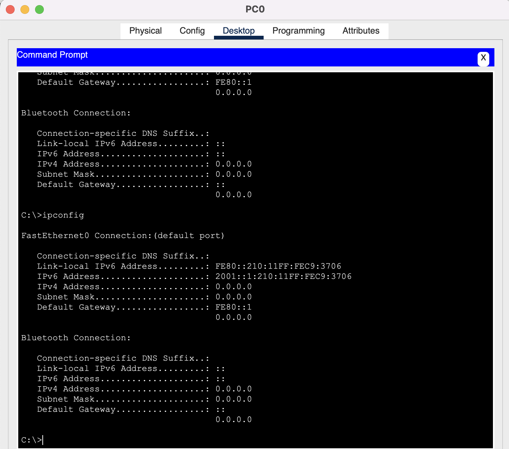

### Задание 1
---

В ipv6 отсутствует broadcast-трафик, на замену ему пришел multicast-трафик.

---
### Задание 2
---

```
ivanlitovka@MacBook-Pro-Ivan SYS-9 % dig AAAA ya.ru

; <<>> DiG 9.10.6 <<>> AAAA ya.ru
;; global options: +cmd
;; Got answer:
;; ->>HEADER<<- opcode: QUERY, status: NOERROR, id: 38828
;; flags: qr rd ra; QUERY: 1, ANSWER: 1, AUTHORITY: 0, ADDITIONAL: 1

;; OPT PSEUDOSECTION:
; EDNS: version: 0, flags:; udp: 1232
;; QUESTION SECTION:
;ya.ru.				IN	AAAA

;; ANSWER SECTION:
YA.ru.			443	IN	AAAA	2a02:6b8::2:242

;; Query time: 71 msec
;; SERVER: 192.168.35.160#53(192.168.35.160)
;; WHEN: Thu Sep 01 12:17:03 MSK 2022
;; MSG SIZE  rcvd: 65

```
---

### Задание 3
---

Какие из этих префиксов содержатся в адресе: 2001:DB8:2314:5678::9ABC:DEF0?   
a, b, c

---

### Задание 4
---

   
[2.5.4.pkt](./files/2.5.4.pkt)

---

### Задание 5
---

   
[2.5.5.pkt](./files/2.5.5.pkt)

---

### Задание 6
---


   
[2.5.6.pkt](./files/2.5.6.pkt)
