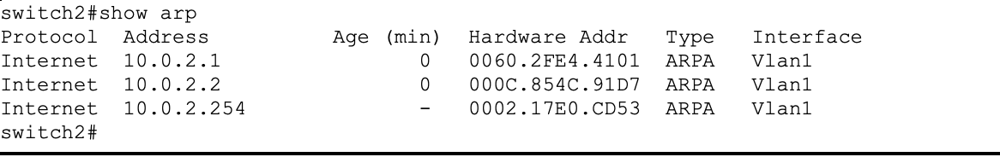

### Задание 1
---
работа протокола ARP, пришел запрос от роутера кто скрывается за указанным IP и ответ от хоста что это "Я"

работа протокола  DHCP, широковещательный запрос от хоста, и ответ от DHCP-сервера с настройками, принятыми сразу

### Задание 2
---
Да так же как и в IPv4, только в IPv6 данные о разбиении на пакета на меньшие пакеты прописывается в поле next header заголовка 
пакета.

### Задание 3
---
switch1

r1

r2

switch2
   

### Задание 4
---

