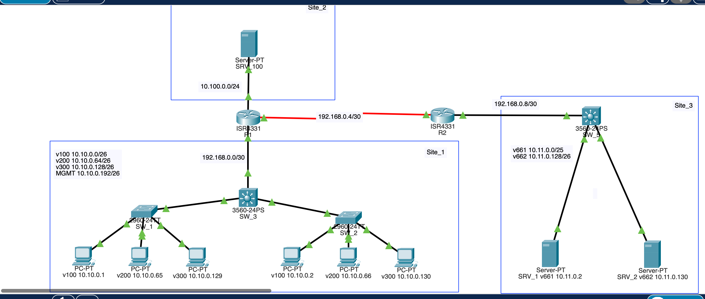
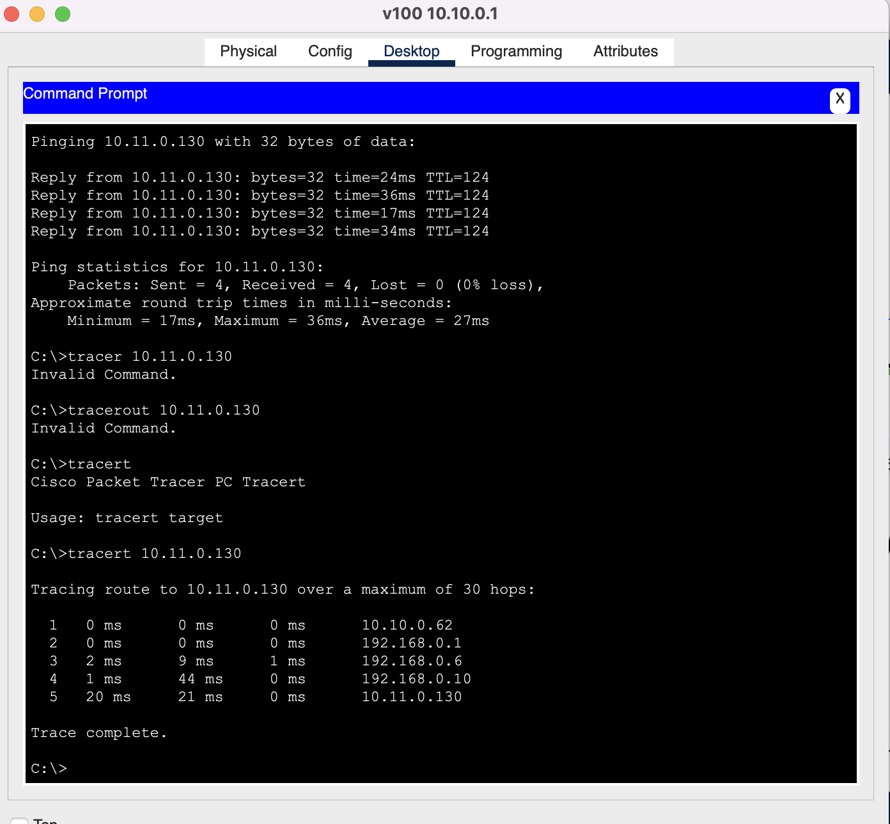

### Задание 1
---
SW_1
```
SW_1#show vlan brief

VLAN Name                             Status    Ports
---- -------------------------------- --------- -------------------------------
1    default                          active    Fa0/4, Fa0/5, Fa0/6, Fa0/7
                                                Fa0/8, Fa0/9, Fa0/10, Fa0/11
                                                Fa0/12, Fa0/13, Fa0/14, Fa0/15
                                                Fa0/16, Fa0/17, Fa0/18, Fa0/19
                                                Fa0/20, Fa0/21, Fa0/22, Fa0/23
                                                Fa0/24, Gig0/2
100  USER_1                           active    Fa0/1
200  USER_2                           active    Fa0/2
300  USER_3                           active    Fa0/3
999  MGMT                             active    
1002 fddi-default                     active    
1003 token-ring-default               active    
1004 fddinet-default                  active    
1005 trnet-default                    active    
SW_1#show in
SW_1#show interfaces tr
SW_1#show interfaces trunk 
Port        Mode         Encapsulation  Status        Native vlan
Gig0/1      on           802.1q         trunking      1

Port        Vlans allowed on trunk
Gig0/1      100,200,300,999

Port        Vlans allowed and active in management domain
Gig0/1      100,200,300,999

Port        Vlans in spanning tree forwarding state and not pruned
Gig0/1      100,200,300,999
```
SW_2
```
SW_2#show vlan brief

VLAN Name                             Status    Ports
---- -------------------------------- --------- -------------------------------
1    default                          active    Fa0/4, Fa0/5, Fa0/6, Fa0/7
                                                Fa0/8, Fa0/9, Fa0/10, Fa0/11
                                                Fa0/12, Fa0/13, Fa0/14, Fa0/15
                                                Fa0/16, Fa0/17, Fa0/18, Fa0/19
                                                Fa0/20, Fa0/21, Fa0/22, Fa0/23
                                                Fa0/24, Gig0/2
100  USER_1                           active    Fa0/1
200  USER_2                           active    Fa0/2
300  USER_3                           active    Fa0/3
999  MGMT                             active    
1002 fddi-default                     active    
1003 token-ring-default               active    
1004 fddinet-default                  active    
1005 trnet-default                    active    
SW_2#show int
SW_2#show interfaces trun
SW_2#show interfaces trunk 
Port        Mode         Encapsulation  Status        Native vlan
Gig0/1      on           802.1q         trunking      1

Port        Vlans allowed on trunk
Gig0/1      100,200,300,999

Port        Vlans allowed and active in management domain
Gig0/1      100,200,300,999

Port        Vlans in spanning tree forwarding state and not pruned
Gig0/1      100,200,300,999

SW_2#
```
SW_3
```
SW_3#show vlan brief

VLAN Name                             Status    Ports
---- -------------------------------- --------- -------------------------------
1    default                          active    Fa0/1, Fa0/2, Fa0/3, Fa0/4
                                                Fa0/5, Fa0/6, Fa0/7, Fa0/8
                                                Fa0/9, Fa0/10, Fa0/11, Fa0/12
                                                Fa0/13, Fa0/14, Fa0/15, Fa0/16
                                                Fa0/17, Fa0/18, Fa0/19, Fa0/20
                                                Fa0/21, Fa0/22, Fa0/23, Fa0/24
100  USER_1                           active    
200  USER_2                           active    
300  VLAN0300                         active    
999  MGMN                             active    
1002 fddi-default                     active    
1003 token-ring-default               active    
1004 fddinet-default                  active    
1005 trnet-default                    active    
SW_3#show int trunk
Port        Mode         Encapsulation  Status        Native vlan
Gig0/1      on           802.1q         trunking      1
Gig0/2      on           802.1q         trunking      1

Port        Vlans allowed on trunk
Gig0/1      100,200,300,999
Gig0/2      100,200,300,999

Port        Vlans allowed and active in management domain
Gig0/1      100,200,300,999
Gig0/2      100,200,300,999

Port        Vlans in spanning tree forwarding state and not pruned
Gig0/1      100,200,300,999
Gig0/2      100,200,300,999
```

### Задание 2
---
R1
```
R1#show ip route

Gateway of last resort is not set

     10.0.0.0/8 is variably subnetted, 6 subnets, 3 masks
S       10.10.0.0/26 [1/0] via 192.168.0.2
S       10.10.0.64/26 [1/0] via 192.168.0.2
S       10.10.0.128/26 [1/0] via 192.168.0.2
S       10.10.0.192/26 [1/0] via 192.168.0.2
C       10.100.0.0/24 is directly connected, GigabitEthernet0/0/1
L       10.100.0.1/32 is directly connected, GigabitEthernet0/0/1
     192.168.0.0/24 is variably subnetted, 2 subnets, 2 masks
C       192.168.0.0/30 is directly connected, GigabitEthernet0/0/0
L       192.168.0.1/32 is directly connected, GigabitEthernet0/0/0
```
SW_3
```
SW_3#show vlan brief 

VLAN Name                             Status    Ports
---- -------------------------------- --------- -------------------------------
1    default                          active    Fa0/1, Fa0/2, Fa0/3, Fa0/4
                                                Fa0/5, Fa0/6, Fa0/7, Fa0/8
                                                Fa0/9, Fa0/10, Fa0/11, Fa0/12
                                                Fa0/13, Fa0/14, Fa0/15, Fa0/16
                                                Fa0/17, Fa0/18, Fa0/19, Fa0/20
                                                Fa0/21, Fa0/22, Fa0/23
100  USER_1                           active    
200  USER_2                           active    
222  ROUTER                           active    Fa0/24
300  VLAN0300                         active    
999  MGMN                             active    
1002 fddi-default                     active    
1003 token-ring-default               active    
1004 fddinet-default                  active    
1005 trnet-default                    active    

SW_3#show ip route 

Gateway of last resort is 192.168.0.1 to network 0.0.0.0

     10.0.0.0/26 is subnetted, 4 subnets
C       10.10.0.0 is directly connected, Vlan100
C       10.10.0.64 is directly connected, Vlan200
C       10.10.0.128 is directly connected, Vlan300
C       10.10.0.192 is directly connected, Vlan999
     192.168.0.0/30 is subnetted, 1 subnets
C       192.168.0.0 is directly connected, Vlan222
S*   0.0.0.0/0 [1/0] via 192.168.0.1
```
### Задание 3
---
R2
```
R2#show ip route

Gateway of last resort is not set

     10.0.0.0/8 is variably subnetted, 2 subnets, 2 masks
S       10.11.0.0/25 [1/0] via 192.168.0.10
S       10.11.0.128/26 [1/0] via 192.168.0.10
     192.168.0.0/24 is variably subnetted, 2 subnets, 2 masks
C       192.168.0.8/30 is directly connected, GigabitEthernet0/0/0
L       192.168.0.9/32 is directly connected, GigabitEthernet0/0/0
```

SW_5
```
SW_5#show vlan brief

VLAN Name                             Status    Ports
---- -------------------------------- --------- -------------------------------
1    default                          active    Fa0/3, Fa0/4, Fa0/5, Fa0/6
                                                Fa0/7, Fa0/8, Fa0/9, Fa0/10
                                                Fa0/11, Fa0/12, Fa0/13, Fa0/14
                                                Fa0/15, Fa0/16, Fa0/17, Fa0/18
                                                Fa0/19, Fa0/20, Fa0/21, Fa0/22
                                                Fa0/23, Fa0/24, Gig0/2
222  ROUTER                           active    Gig0/1
661  SRV_1_CORE                       active    Fa0/1
662  SRV_2_CORE                       active    Fa0/2
1002 fddi-default                     active    
1003 token-ring-default               active    
1004 fddinet-default                  active    
1005 trnet-default                    active 
```

### Задание 4
---
  


R1
```
R1#show ip route

Gateway of last resort is not set

     10.0.0.0/8 is variably subnetted, 8 subnets, 4 masks
S       10.10.0.0/26 [1/0] via 192.168.0.2
S       10.10.0.64/26 [1/0] via 192.168.0.2
S       10.10.0.128/26 [1/0] via 192.168.0.2
S       10.10.0.192/26 [1/0] via 192.168.0.2
S       10.11.0.0/25 [1/0] via 192.168.0.6
S       10.11.0.128/26 [1/0] via 192.168.0.6
C       10.100.0.0/24 is directly connected, GigabitEthernet0/0/1
L       10.100.0.1/32 is directly connected, GigabitEthernet0/0/1
     192.168.0.0/24 is variably subnetted, 4 subnets, 2 masks
C       192.168.0.0/30 is directly connected, GigabitEthernet0/0/0
L       192.168.0.1/32 is directly connected, GigabitEthernet0/0/0
C       192.168.0.4/30 is directly connected, Serial0/1/0
L       192.168.0.5/32 is directly connected, Serial0/1/0
```
R2
```
R1#show ip route

Gateway of last resort is not set

     10.0.0.0/8 is variably subnetted, 8 subnets, 4 masks
S       10.10.0.0/26 [1/0] via 192.168.0.2
S       10.10.0.64/26 [1/0] via 192.168.0.2
S       10.10.0.128/26 [1/0] via 192.168.0.2
S       10.10.0.192/26 [1/0] via 192.168.0.2
S       10.11.0.0/25 [1/0] via 192.168.0.6
S       10.11.0.128/26 [1/0] via 192.168.0.6
C       10.100.0.0/24 is directly connected, GigabitEthernet0/0/1
L       10.100.0.1/32 is directly connected, GigabitEthernet0/0/1
     192.168.0.0/24 is variably subnetted, 4 subnets, 2 masks
C       192.168.0.0/30 is directly connected, GigabitEthernet0/0/0
L       192.168.0.1/32 is directly connected, GigabitEthernet0/0/0
C       192.168.0.4/30 is directly connected, Serial0/1/0
L       192.168.0.5/32 is directly connected, Serial0/1/0
```

