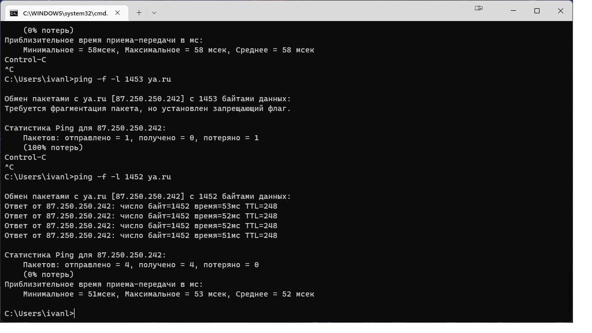
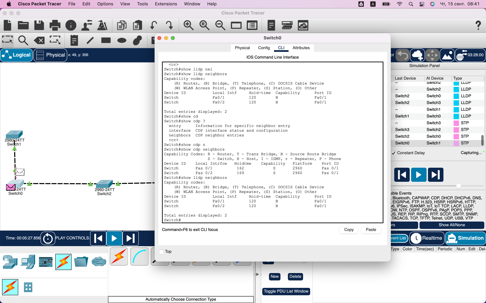

### Задание 1
---
Путем перебора длины пакета в команде Ping можно выяснить допустимы размер пакета, при этом обязательно надо поставить флаг запрещающий фрагментацию.

### Задание 2
---
1) Пипингую адрес назначения с хоста пользователя, посмотрю есть ли потеря пакетов. Запущу трасировку, изучу задержки на разных 
участках сети.   
2) переключу пользователя на другой свободный порт в коммутаторе, если не поможет то перезагружу оборудование. В случае если проблема 
решена, то надо понаблюдать за работой оборудования и при возникновении данной ситуации снова - оборудование подлежит замене.
3) А еще возможно проблема с самим хостом, программным обеспечением, ОС, железом АРМ сотрудника.   
П.С. Это должно было быть первым пунктом - понять что пользователь подразумевает под низкой скоростью.

### Задание 3
---
На схеме гибридная топология сети.
по поводу передачи информации тут да сможет, т.к. отработает STP протокол и разорвет петлю для пакетов.
Но даже без STP пакеты пойду по кратчайшему маршруту, была потеря одного пакета, но далее все пакеты шли без проблем. Но в больших 
сетях данные ситуации надо избегать или держать включенным STP.

### Задание 4
---

