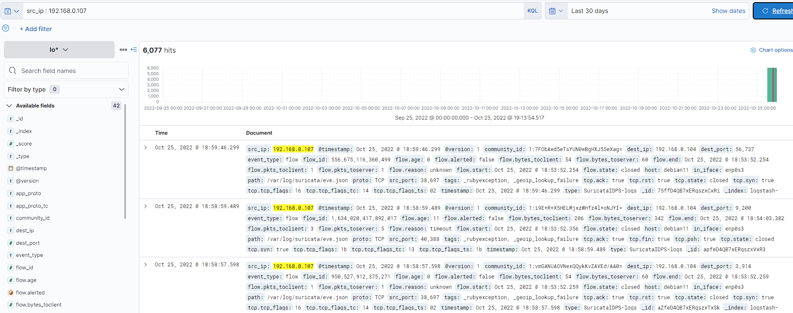
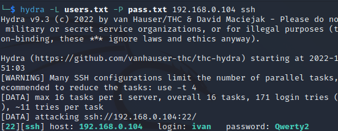
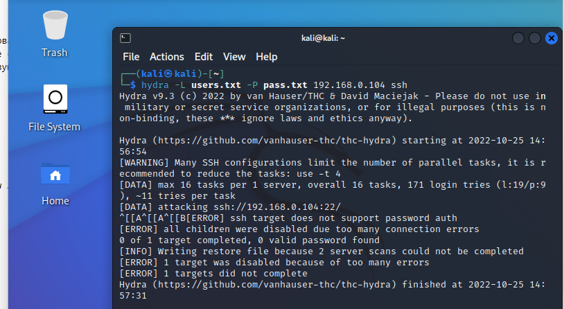
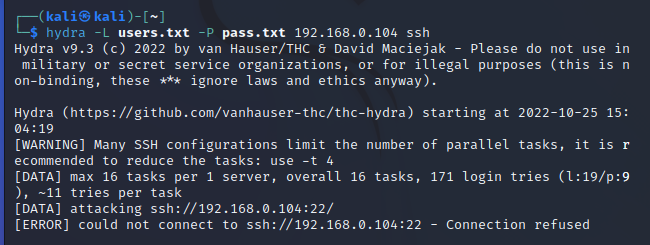
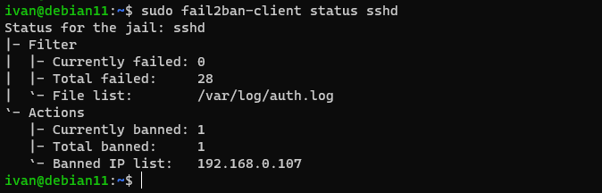

# Домашнее задание к занятию 5.08 "Обзор средств информационной безопасности"

------

### Задание 1.

Проведите разведку системы и определите, какие сетевые службы запущены на "защищаемой" системе:
**sudo nmap -sA < ip-адрес >**
**sudo nmap -sT < ip-адрес >**
**sudo nmap -sS < ip-адрес >**
**sudo nmap -sV < ip-адрес >**
*В качестве ответа пришлите события, которые попали в логи Suricata и Fail2Ban, прокомментируйте результат.*

------



В логах Suricata можно увидеть с какого адреса и порта приходят запросы и на какой порт. Так же начало и конец TCP сессии, стадии согласования TCP-сессии.
В процессе иследований получил бан для Kali и хостовой системы


### Задание 2.

Проведите атаку на подбор пароля для службы SSH:

**hydra -L users.txt -P pass.txt < ip-адрес > ssh**

1. Настройка **hydra**: 
 
 - создайте два файла: **users.txt** и **pass.txt**;
 - в каждой строчке первого файла должны быть имена пользователей, второго - пароли (в нашем случае это могут быть случайные строки, но ради эксперимента можете добавить имя и пароль существующего пользователя).

2. Включение защиты SSH для Fail2Ban:

-  Открыть файл /etc/fail2ban/jail.conf;
-  Найти секцию **ssh**;
-  Установить **enabled**  в **true**.

*В качестве ответа пришлите события, которые попали в логи Suricata и Fail2Ban, прокомментируйте результат*

Создал конфиг для fail2ban
/etc/fail2ban/jail.d/defaults-debian.conf
```conf
[DEFAULT]
maxretry = 4
findtime = 480
bantime = 720
action = iptables
ignoreip = 127.0.0.1/8 192.168.0.101/24

[sshd]
enabled = true
```
Дальше хотел рассказать что ничего не работает спустя 2 часа возни, но тут все заработало, как только убрал из игнора IP машины на которой крутится VirtualBox, хотя по идеи это не должно было мешать так как атака шла с IP 192.168.0.107, но это наверно особенности тестов на виртуалках. Ниже скриншоты работы fail2ban по защите от перебора пароля для sshd   
**Успешная атака**
   
**Включаем правило, получаем ошибку**
   
**Дальнейшее сканирование невозможно, т.к. соединение по ssh отклоняется удаленным хостом**
   
**IP злоумышленника попадает в бан на удаленной системе**


