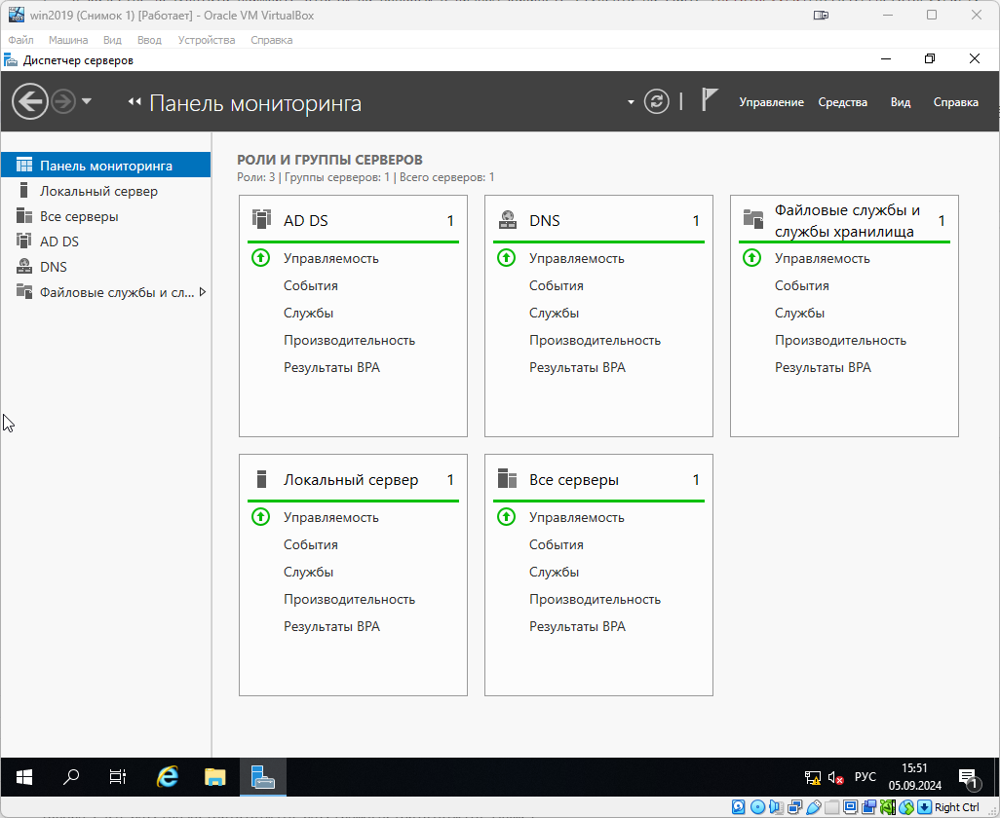

# Домашнее задание к занятию «Active Directory. Часть 1»

В качестве результата пришлите ответы на вопросы в личном кабинете студента на сайте [netology.ru](https://netology.ru/).

## 

### Задание 1

1. Скачайте и установите Windows Server 2019 (2016), используя файл по [ссылке](https://www.microsoft.com/en-us/evalcenter/evaluate-windows-server-2019). 

2. Настройте Active Directory:

*Дайте ответ в виде снимков экрана.*

------

### Задание 2

Создайте в AD:

- пользователя `student1`, входящего в группу `students1`;
- пользователя `student2`, входящего в группу `students2`.

*Дайте ответ в виде снимков экрана.*

------

### Задание 3

- Создайте или используйте существующую ВМ с установленной ОС Windows и подключите к домену [ссылке](https://docs.microsoft.com/ru-ru/windows-server/identity/ad-fs/deployment/join-a-computer-to-a-domain);
- Зайдите под доменными учётными записями.

*Дайте ответ в виде снимков экрана.*

------

## Дополнительные задания со звёздочкой.

Эти задания необязательные.  Их выполнение никак не влияет на получение зачёта по домашней работе. Вы можете их выполнить, если хотите усвоить полученный материал и лучше разобраться в теме.

------

### Задание 4*

Настройте любую политику GPO и проверьте, что она распространилась на рабочую станцию:

- https://1cloud.ru/help/windows/gruppovye-politiki-active-directory;
- https://windowsnotes.ru/activedirectory/primenenie-gruppovyx-politik-chast-1/.

*Дайте ответ в виде снимков экрана.*
