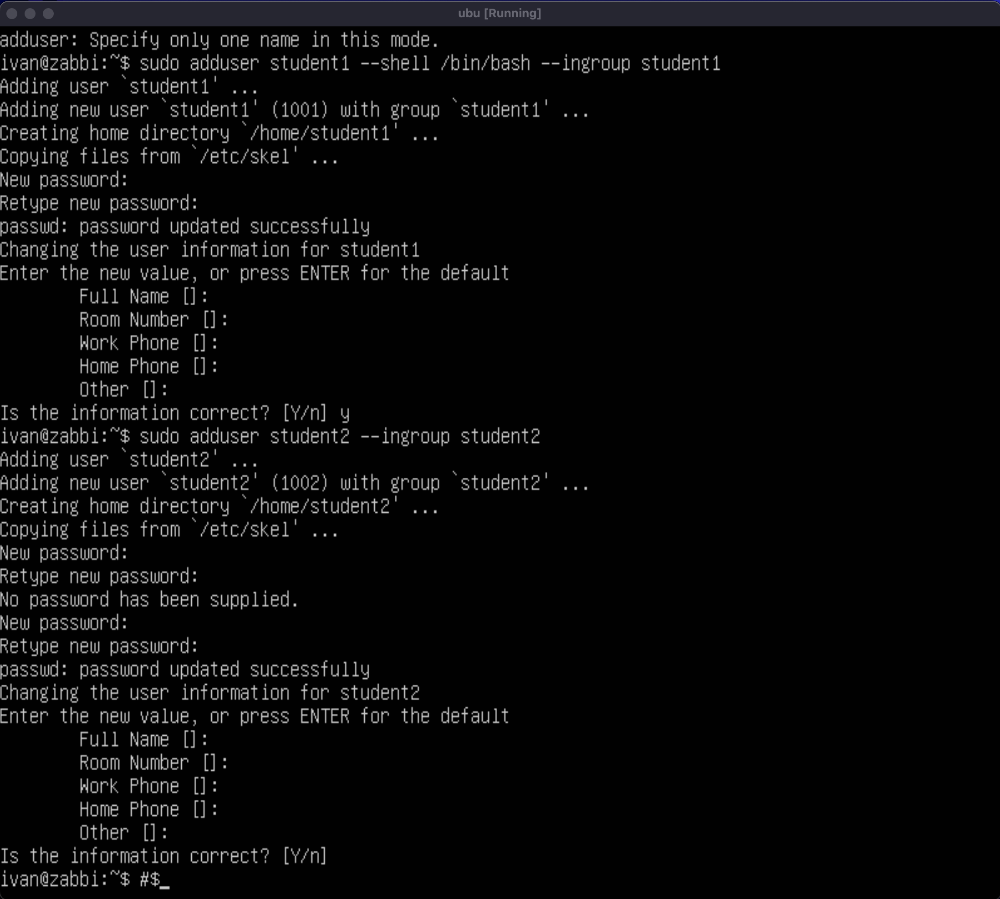
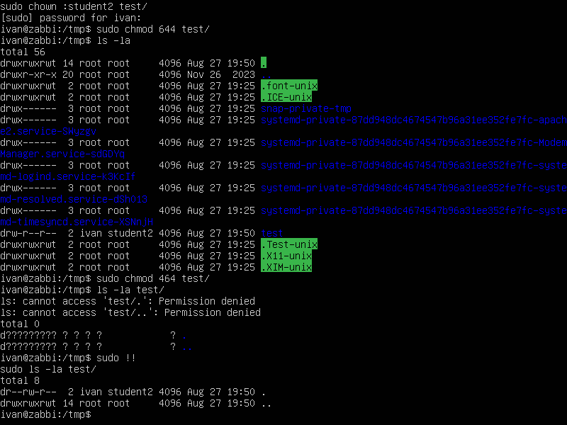
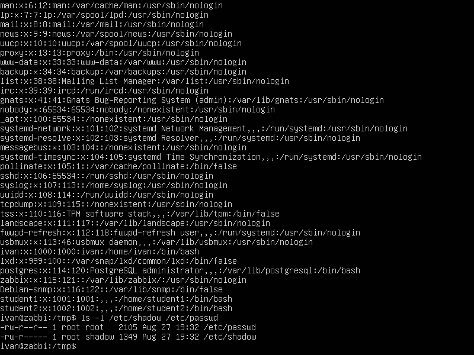

# Домашнее задание к занятию «Linux Hardening»

## Студент: Литовка Иван

В качестве результата пришлите ответы на вопросы в личном кабинете студента на сайте [netology.ru](https://netology.ru/).

## 

### Задание 1

- Создайте пользователя `student1` с оболочкой bash, входящего в группу `student1`.
- Создайте пользователя `student2`, входящего в группу `student2`.

*Дайте ответ в виде снимков экрана.*

------

### Задание 2

- Создайте в общем каталоге, например, /tmp, директорию.
- Назначьте для неё полный доступ со стороны группы `student2` и доступ на чтение всем остальным.

*Дайте ответ в виде снимков экрана.*

------

### Задание 3

- Определите, какой режим доступа установлен для файлов `/etc/passwd` и `/etc/shadow`.
- Объясните, зачем понадобилось именно два файла.  

*Дайте ответ в виде снимков экрана.*

В etc/passwd хранится основная информация о пользователях, его Ид, ИД группы, домашня дириктория, оболочка по умолчанию.   

В etc/shadow хранится информация о фактических паролях пользователей в зашифрованном виде. На самом деле, есть хэш пароля с дополнительными свойствами, относящиеся к паролям пользователя, такие как даты истечения срока действия пароля. Файл etc/passwd доступен для чтения, а это означает, что любой пользователь может его прочитать, но файл etc/shadow доступен для чтения только учетной записи root.

------

### Задание 4*

Изучите информацию о SELinux из открытых источников.

Ответьте на вопросы:

- Что из того, что предлагает SELinux, может быть реализовано в стандартном Linux?
- Можно ли установить SELinux поверх существующей ОС Linux?

*Дайте ответ в свободной форме.*

------
Думаю то что способен дать SElinux средствами ОС не реализовать. Максимум можно назначить права, владельцнв программ и дать только им запускать их, но контролировать ресурсы и доступ к ним на уровне ядра нет.   

Установить поверх ядра можно, это будет новое ядро с SELinux внутри.