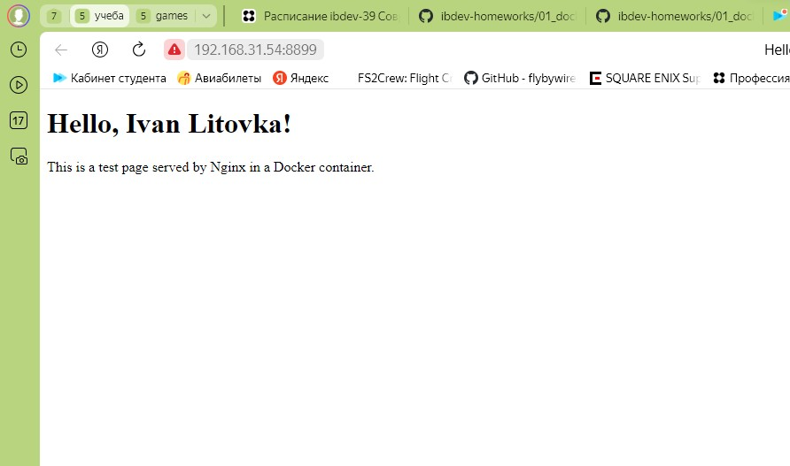

# Домашнее задание к занятию «1.1. Контейнеризация (Docker)»

### Цель задания

Docker - это инструмент, который помогает упаковать приложения в специальные контейнеры. Это своего рода коробка, в которой есть все необходимое для запуска приложения: код приложения, его зависимости, библиотеки и настройки.

Docker предоставляет среду для управления и изоляции приложений. Таким образом контейнеры могут быть запущены в изолированных средах. С Docker можно создавать и тестировать различные среды. Это позволяет специалистам по ИБ проводить тестирование на проникновение и оценивать безопасность приложений в контролируемой среде, не затрагивая реальные рабочие системы.

В этом домашнем задании вы выполните несколько практических задач, которые помогут вам освоить работу с образами и контейнерами Docker на базовом уровне. Для того, чтобы вы не отвлекались на поиск и повторение теории, в этом задании мы подготовили подробный алгоритм под каждую задачу. Вам достаточно перейти по соответствующей ссылке к заданию.

В результате выполнения задания вы сможете:

1. Устанавливать и настраивать базовые компоненты Docker.
2. Выполнять базовые приёмы работы с образами и контейнерами.
3. Работать с командами bash и сравнивать результаты из контейнера с результатами команд в основной системе.
4. Собирать преднастроенные образы Docker с помощью конфигурационного файла Dockerfile.
5. Запускать контейнер с автоматическим выполнением преднастроенного сценария.
6. Запускать подготовленную связку контейнеров с помощью конфигурационного файла docker-compose.yml.

## Задание 1. Образы и контейнеры Docker

### Описание задания

Необходимо установить базовые компоненты Docker. Выполните загрузку готового образа из общедоступного репозитория, запустите контейнер на основе загруженного образа, реализуйсте базовые операции с контейнерами и образами.

Выполните задание, руководствуясь подробной [инструкцией](https://github.com/netology-code/ibdev-homeworks/blob/master/01_docker_new/task/docker.md).

### Результат выполненного задания

В качестве результата работы вам необходимо предоставить отчёт, включающий следующие скриншоты с вашими текстовыми комментариями:
- скриншот вывода результатов команды `ifconfig` (на Kali Linux) или `ip a` (на Ubuntu);
```
PS D:\netology-homework\netology-homework> ipconfig        

Настройка протокола IP для Windows


Неизвестный адаптер Подключение по локальной сети 2:

   Состояние среды. . . . . . . . : Среда передачи недоступна.
   DNS-суффикс подключения . . . . . :

Неизвестный адаптер Подключение по локальной сети:

   Состояние среды. . . . . . . . : Среда передачи недоступна.
   DNS-суффикс подключения . . . . . :

Адаптер Ethernet Ethernet 2:

   DNS-суффикс подключения . . . . . :
   Локальный IPv6-адрес канала . . . : fe80::2c40:3b27:8e78:6b25%16
   IPv4-адрес. . . . . . . . . . . . : 192.168.56.1
   Маска подсети . . . . . . . . . . : 255.255.255.0
   Основной шлюз. . . . . . . . . :

Неизвестный адаптер OpenVPN Connect DCO Adapter:

   Состояние среды. . . . . . . . : Среда передачи недоступна.
   DNS-суффикс подключения . . . . . :

Адаптер Ethernet Ethernet:

   DNS-суффикс подключения . . . . . :
   IPv4-адрес. . . . . . . . . . . . : 192.168.31.54
   Маска подсети . . . . . . . . . . : 255.255.255.0
   Основной шлюз. . . . . . . . . : 192.168.31.1

Адаптер Ethernet SSTAP 1:

   Состояние среды. . . . . . . . : Среда передачи недоступна.
   DNS-суффикс подключения . . . . . :

Адаптер Ethernet vEthernet (WSL):

   DNS-суффикс подключения . . . . . :
   Локальный IPv6-адрес канала . . . : fe80::340d:4fdd:5241:7e70%62
   IPv4-адрес. . . . . . . . . . . . : 172.20.208.1
   Маска подсети . . . . . . . . . . : 255.255.240.0
   Основной шлюз. . . . . . . . . :
```

- скриншот вывода результатов команды `sudo docker pull bash`;
```
PS D:\netology-homework\netology-homework> docker pull bash
Using default tag: latest
latest: Pulling from library/bash
ec99f8b99825: Pull complete
78c48dda0d5c: Pull complete
cb257a418ffa: Pull complete
Digest: sha256:4b5f0dfc184cd521d6cd01d0dc8096cdb216b1d7f0a2d23f6e7577be97997434
Status: Downloaded newer image for bash:latest
docker.io/library/bash:latest
```

- скриншот вывода результатов команды `sudo docker run -it bash`;
```
PS D:\netology-homework\netology-homework> docker run -it bash
bash-5.2# 
```

- скриншот вывода результатов команды `sudo docker stop names`;
```
PS D:\netology-homework\netology-homework> docker container ps --all
CONTAINER ID   IMAGE     COMMAND                  CREATED         STATUS                      PORTS     NAMES
aef1aad319ae   bash      "docker-entrypoint.s…"   3 minutes ago   Exited (0) 21 seconds ago             laughing_mcclintock
PS D:\netology-homework\netology-homework> docker stop laughing_mcclintock
laughing_mcclintock
```
- скриншот вывода результатов команды `sudo docker rm names`;
```
PS D:\netology-homework\netology-homework> docker rm laughing_mcclintock  
laughing_mcclintock
```
- скриншот вывода результатов команды `sudo docker rmi repository`;
```
PS D:\netology-homework\netology-homework> docker rmi repository     
Error response from daemon: No such image: repository:latest
```
- скриншот вывода результатов команды `sudo docker ps -a`;
```
PS D:\netology-homework\netology-homework> docker ps -a
CONTAINER ID   IMAGE     COMMAND   CREATED   STATUS    PORTS     NAME
```
- скриншот вывода результатов команды `sudo docker image ls`.
```
PS D:\netology-homework\netology-homework> docker image ls
REPOSITORY   TAG       IMAGE ID       CREATED       SIZE
bash         latest    d1cd14507306   4 weeks ago   14.4MB
```

## Задание 2. Bash в Docker

### Описание задания

Необходимо выполнить работу с контейнером Docker в интерактивном режиме и предоставить объективные доказательства присутствия в контейнере.

Выполните задание, руководствуясь подробной [инструкцией](https://github.com/netology-code/ibdev-homeworks/blob/master/01_docker_new/task/bash.md).

### Результат выполненного задания

В качестве результата работы вам необходимо предоставить отчёт, включающий следующие скриншоты с вашими текстовыми комментариями:
- скриншот вывода результатов команды `sudo docker run –rm -it bash`;
```
PS D:\netology-homework\netology-homework> docker run -it --rm bash
bash-5.2# 
```
- скриншот вывода результатов команды `whoami` и `cat /etc/*release*` (в контейнере);
```
bash-5.2# whoami
root
bash-5.2# cat /etc/*release*
3.20.1
NAME="Alpine Linux"
ID=alpine
VERSION_ID=3.20.1
PRETTY_NAME="Alpine Linux v3.20"
HOME_URL="https://alpinelinux.org/"
BUG_REPORT_URL="https://gitlab.alpinelinux.org/alpine/aports/-/issues"
bash-5.2#
```
- скриншот вывода результатов команды `ls -la /` (в контейнере);
```
bash-5.2# ls -la /
total 68
drwxr-xr-x    1 root     root          4096 Jun 21 21:02 .
drwxr-xr-x    1 root     root          4096 Jun 21 21:02 ..
-rwxr-xr-x    1 root     root             0 Jun 21 21:02 .dockerenv
drwxr-xr-x    1 root     root          4096 Jun 20 20:55 bin
drwxr-xr-x    5 root     root           360 Jun 21 21:02 dev
drwxr-xr-x    1 root     root          4096 Jun 21 21:02 etc
drwxr-xr-x    2 root     root          4096 Jun 18 14:16 home
drwxr-xr-x    1 root     root          4096 Jun 20 20:55 lib
drwxr-xr-x    5 root     root          4096 Jun 18 14:16 media
drwxr-xr-x    2 root     root          4096 Jun 18 14:16 mnt
drwxr-xr-x    2 root     root          4096 Jun 18 14:16 opt
dr-xr-xr-x  362 root     root             0 Jun 21 21:02 proc
drwx------    2 root     root          4096 Jun 18 14:16 root
drwxr-xr-x    2 root     root          4096 Jun 18 14:16 run
drwxr-xr-x    2 root     root          4096 Jun 18 14:16 sbin
drwxr-xr-x    2 root     root          4096 Jun 18 14:16 srv
dr-xr-xr-x   11 root     root             0 Jun 21 21:02 sys
drwxrwxrwt    2 root     root          4096 Jun 18 14:16 tmp
drwxr-xr-x    1 root     root          4096 Jun 20 20:55 usr
drwxr-xr-x   12 root     root          4096 Jun 18 14:16 var
```
- скриншот вывода результатов команды `whoami` и `cat /etc/*release*` (в основной системе);
```
PS D:\netology-homework\netology-homework> ls


    Каталог: D:\netology-homework\netology-homework


Mode                 LastWriteTime         Length Name
----                 -------------         ------ ----
d-----        02.06.2024     11:37                .idea
d-----        17.10.2023      4:16                NTW-10
d-----        21.06.2024     23:36                SIB-39
-a----        02.06.2024      9:37             49 .gitignore


PS D:\netology-homework\netology-homework> whoami 
desktop-segoo7m\ivanl
PS D:\netology-homework\netology-homework> 
```
- скриншот вывода результатов команды `ls -la /` (в основной системе).

## Задание 3. Dockerfile

### Описание задания

Вы запустили контейнер на основе готового образа из общедоступного репозитория Docker HUB и вручную выполнили отдельные команды для решения простых задач. Далее необходимо подготовить образ, который будет содержать заложенные директивы. Они будут автоматически выполнены при запуске контейнера. Директивы прописываются в специальном конфигурационном файле Dockerfile.

В этом задании вы:
- подготовите файл скрипта с командами, которые планируется автоматически выполнить в контейнере bash;
- подготовите конфигурационный файл Dockerfile с директивами для сборки преднастроенного образа;
- выполните сборку образа, который будет включать преднастроенный сценарий для контейнера;
- запустите контейнер на основе преднастроенного образа и получите результаты выполнения команд после автоматического запуска скрипта;
- запустите вручную этот скрипт в командной оболочке основной системы Kali Linux;
- сравните полученные результаты из контейнера и основной системы.

Выполните задание, руководствуясь подробной [инструкцией](https://github.com/netology-code/ibdev-homeworks/blob/master/01_docker_new/task/dockerfile.md).

### Результат выполненного задания

В качестве результата работы вам необходимо предоставить отчёт, включающий следующие скриншоты с вашими текстовыми комментариями:
- скриншот вывода содержимого файла скрипта `cat my_bash_1.sh` (необходимо указывать назначенное вами имя скрипта);
```
# определяем переменную для ФИО
my_name='Ivan Litovka'
# вставляем пустую строку
echo ''
# выводим версию и номер релиза ОС
cat /etc/*release*
# вставляем пустую строку
echo ''
# выводим ФИО
echo ${my_name}
# выводим текущую дату и время
date +'%d/%m/%Y %H:%M:%S'
```
- скриншот вывода содержимого файла Dockerfile `cat Dockerfile`;
```
# создать контейнер на основе образа
FROM bash:latest
# загрузить в корневой каталог контейнера файл
COPY my_script.sh /
# назначить файлу права на выполнение
RUN chmod +x my_script.sh
# после запуска контейнера запустить в
# командной оболочке контейнера исполняемый файл
CMD ["./my_script.sh"]
```
- скриншот результатов сборки образа `sudo docker build -t image_bash_1 .` (необходимо указывать назначенное вами имя образа);
```
PS D:\netology-homework\netology-homework\SIB-39\IBDEV-39\files> docker build -t image_exe1 .
[+] Building 0.5s (8/8) FINISHED                                                                          docker:default
 => [internal] load .dockerignore                                                                                   0.0s
 => => transferring context: 2B                                                                                     0.0s 
 => [internal] load build definition from dockerfile                                                                0.0s 
 => => transferring dockerfile: 516B                                                                                0.0s 
 => [internal] load metadata for docker.io/library/bash:latest                                                      0.0s
 => [internal] load build context                                                                                   0.1s 
 => => transferring context: 445B                                                                                   0.0s 
 => [1/3] FROM docker.io/library/bash:latest                                                                        0.1s 
 => [2/3] COPY my_script.sh /                                                                                       0.0s 
 => [3/3] RUN chmod +x my_script.sh                                                                                 0.2s
 => exporting to image                                                                                              0.1s
 => => exporting layers                                                                                             0.1s 
 => => writing image sha256:4717dd3d727a17368eb5fdbbff4a4d61cbf2224b0782432345328627488ca0b7                        0.0s
 => => naming to docker.io/library/image_exe1   
```

- скриншот результатов запуска контейнера `sudo docker run –rm image_bash_1` (необходимо указывать назначенное вами имя образа);
```
PS D:\netology-homework\netology-homework\SIB-39\IBDEV-39\files> docker run --rm image_exe1    

3.20.1
NAME="Alpine Linux"
ID=alpine
VERSION_ID=3.20.1
PRETTY_NAME="Alpine Linux v3.20"
HOME_URL="https://alpinelinux.org/"
BUG_REPORT_URL="https://gitlab.alpinelinux.org/alpine/aports/-/issues"

Ivan Litovka
21/06/2024 21:22:04
```
- скриншот результатов запуска скрипта в основной системе `./my_bash_1.sh` (необходимо указывать назначенное вами имя скрипта).
```
В Windows не работает
```
**Важно**: вы можете доработать скрипт и Dockerfile, но на предоставленных скриншотах обязательно должны присутствовать: характерные отличительные признаки контейнера и основной системы, ваше Ф.И.О., дата и время.

## Задание 4. Docker-compose

### Описание задания

Необходимо реализовать запуск подготовленной связки контейнеров с использованием конфигурационного файла docker-compose.yml.

До сих пор вы взаимодействовали с одиночным контейнером, как обособленным элементов для решения своих задач. Теперь вам предстоит поработать с более сложной технологией контейнеризации - запуском подготовленной связки контейнеров (не менее двух). Это отдельные программные сервисы, которые взаимодействуют между собой в рамках единой задачи. 

В этом задании вы:
- загрузите из общедоступного репозитория Docker HUB два готовых образа;
- подготовите два файла, необходимые для реализации проекта: index.html и docker-compose.yml;
- запустите связку из двух контейнеров;
- отработайте базовые команды для управления связкой контейнеров;
- замените в одном из контейнеров исходный файл HTML своим подготовленным экземпляром;
- проведёте анализ полученных результатов.

Выполните задание, руководствуясь подробной [инструкцией](https://github.com/netology-code/ibdev-homeworks/blob/master/01_docker_new/task/dockercompose.md).

### Результат выполненного задания

В качестве результата работы вам необходимо предоставить отчёт, включающий следующие скриншоты с вашими текстовыми комментариями:
- скриншот вывода содержимого подготовленного вами файла `index.html`, содержащий ваше Ф.И.О.;
```html
<!DOCTYPE html>
<html>
<head>
 	<title>Hello, Ivan Litovka!</title>
</head>
<body>
 	<h1>Hello, Ivan Litovka!</h1>
 	<p>This is a test page served by Nginx in a Docker container.</p>
</body>
</html>
```

- скриншот вывода содержимого подготовленного вами файла `docker-compose.yml`;
```yml
version: '3'
services:
# имя сервиса
  nginx:
# используемый образ для первого контейнера
    image: nginx
# пробросить внутренний порт 80 наружу как 8899
    ports:
      - 8899:80
# имя сервиса
  curl:
# используемый образ для второго контейнера
    image: curlimages/curl
# после запуска второго контейнера выполнить указанный запрос к сервису первого контейнера
    command: "curl http://192.168.31.54:8899"
# второму контейнеру дождаться готовности первого
    depends_on:
      - nginx
```

- скриншот результатов запуска подготовленной вами связки контейнеров;
```
files-nginx-1  | 2024/06/21 23:29:29 [notice] 1#1: start worker process 45
files-curl-1   |   % Total    % Received % Xferd  Average Speed   Time    Time     Time  Current
files-curl-1   |                                  Dload  Upload   Total   Spent    Left  Speed
files-nginx-1  | 172.25.0.1 - - [21/Jun/2024:23:29:29 +0000] "GET / HTTP/1.1" 200 207 "-" "curl/8.8.0" "-"
100   207  100   207    0     0  90909      0 --:--:-- --:--:-- --:--:--  101k
files-curl-1   | <!DOCTYPE html>
files-curl-1   | <html>
files-curl-1   | <head>
files-curl-1   |        <title>Hello, Ivan Litovka!</title>
files-curl-1   | </head>
files-curl-1   | <body>
files-curl-1   |        <h1>Hello, Ivan Litovka!</h1>
files-curl-1   |        <p>This is a test page served by Nginx in a Docker container.</p>
files-curl-1   | </body>
files-curl-1   | </html>
files-curl-1 exited with code 0
files-nginx-1  | 172.25.0.1 - - [21/Jun/2024:23:29:38 +0000] "GET / HTTP/1.1" 200 207 "-" "Mozilla/5.0 (Windows NT 10.0; Win64; x64) AppleWebKit/537.36 (KHTML, like Gecko) Chrome/122.0.0.0 YaBrowser/24.4.0.0 Safari/537.36" "-"
```
- скриншот первоначальной титульной страницы Nginx при подключении браузером к контейнеру;
- скриншот запуска связки контейнеров после замены файла `index.html` в контейнере, содержащий ваше Ф.И.О.;
- скриншот вашего варианта титульной страницы Nginx при подключении браузером к контейнеру, содержащий ваше Ф.И.О.;

- скриншот вывода результатов команды остановки связки контейнеров.
```
PS D:\netology-homework\netology-homework\SIB-39\IBDEV-39\files> docker-compose down        
[+] Running 3/3
 ✔ Container files-curl-1   Removed                                                                                                             0.0s 
 ✔ Container files-nginx-1  Removed                                                                                                            10.4s 
 ✔ Network files_default    Removed                                                                                                             0.2s 
PS D:\netology-homework\netology-homework\SIB-39\IBDEV-39\files> 
```
**Важно**: вы можете подготовить свой вариант титульной страницы в формате HTML, но он обязательно должен содержать ваше Ф.И.О., а также добавить дополнительные директивы в конфигурационный файл `docker-compose.yml` и дополнительные сервисы, взаимодействующие с Nginx.