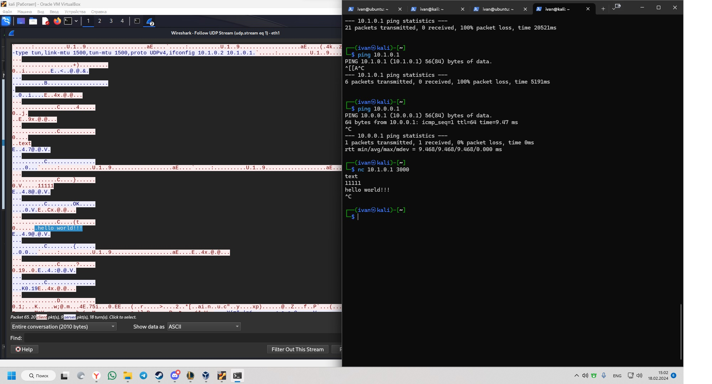
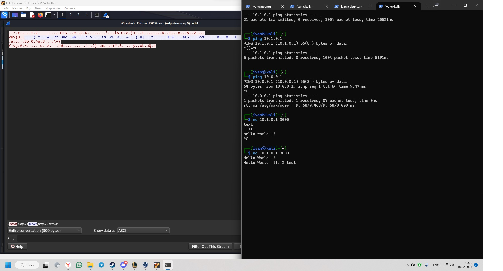

# Домашнее задание к занятию «Виртуальные частные сети (VPN)»

__Студент: Иван Литовка__

### Вопросы

1\. Пришлите скриншот Wireshark, где видно, что данные передаются в открытом виде (для раздела PlainText)

  

2\. Пришлите скриншот Wireshark, где видно, что данные не передаются в открытом виде (для раздела Shared Key)  

  

На сервере или на клиенте запустите команду с флагом `--verb 3`, например, на Kali - `sudo openvpn --ifconfig 10.1.0.2 10.1.0.1 --dev tun --remote 10.0.0.1 --secret vpn.key --verb 3`

Внимательно изучите вывод и пришлите ответы на следующие вопросы:

3\. Какая версия OpenSSL используется

OpenSSL 3.1.4 24 Oct 2023

4\. Какой алгоритм (и с какой длиной ключа) используется для шифрования  

BF-CBC шифрует блоками по 64 bit 128 битным ключом

5\. Какой алгоритм (и с какой длиной ключа) используется дла HMAC аутентификации

SHA1 160 bit digest size

Посмотреть все доступные алгоритмы с помощью команд: `sudo openvpn --show-ciphers` и `sudo openvpn --show-digests` соответственно.

Указать конкретные с помощью флага `--cipher`, например, `--cipher AES-128-CBC` (или просто `--cipher AES128`) и `--auth`, например, `--auth SHA256`, соответственно (удостоверьтесь, что после указания иных алгоритмов в логе вывод тоже меняется).

6\. Что будет выведено в консоли сервера (`sudo openvpn --ifconfig 10.1.0.1 10.1.0.2 --dev tun --secret vpn.key --cipher AES128 --auth SHA256 --verb 3`), если:

6\.1\. Подключиться с клиента командой: `sudo openvpn --ifconfig 10.1.0.2 10.1.0.1 --dev tun --remote 10.0.0.1 --secret vpn.key --cipher AES256 --auth SHA256 --verb 3`   

Ошибка аутентификации/расшифровки пакета: расшифровка пакета не удалась

6\.2\. Подключиться с клиента командой: `sudo openvpn --ifconfig 10.1.0.2 10.1.0.1 --dev tun --remote 10.0.0.1 --secret vpn.key --cipher AES128 --auth SHA512 --verb 3`  

Ошибка аутентификации/расшифровки пакета: аутентификация пакета HMAC не удалась