**1.	Характеристика инцидента.**
Службой безопасности компании «Х» была зафиксирована подозрительная сетевая активность. Необходимо, расследовать инцидент и найти следы активности атакующих. 

**2.	Описание инцидента по матрице MITRE ATT&CK**
| Этап                                           |                              Техника                              |                                                                       | Обоснование                                                                                                     |
|------------------------------------------------|:-----------------------------------------------------------------:|:---------------------------------------------------------------------:|-----------------------------------------------------------------------------------------------------------------|
| Initial Access (Первоначальный доступ)         | Phishing:Spearphishing   Attachment                               | T1566.001: Целевой   фишинг с вложением                               | Целевое письмо,   содержащее архив “Refund_form.zip” с вредоносным файлом                                       |
| Execution (Выполнение)                         | User Execution:   Malicious File                                  | T1204.002:   Вредоносный файл                                         | “Refund_form.lnk”   архив замаскированный под файл “WordPad” выполняющий вредоносный скрипт                     |
| Persistence (Закрепление)                      | Scheduled Task/Job: Scheduled Task                                | T1053.005:   Планировщик заданий Windows                              | Создано 2 задачи с   постоянным выполнением                                                                     |
|                                                |                                                                   |                                                                       |                                                                                                                 |
|                                                | Create   Account                                                  | T1136: Создание   учетной записи                                      | Создание нового пользователя                                                                                    |
| Privilege Escalation   (Повышение привилегий)  | Valid Accounts: Local Accounts                                    | T1078.003: Локальные   учетные записи                                 | Получение доступа к аккаунту   легитимного пользователя                                                         |
|                                                |                                                                   |                                                                       |                                                                                                                 |
|                                                |                                                                   | T1055:                                                                |                                                                                                                 |
|                                                |                                                                   | Внедрение   кода в процессы                                           |                                                                                                                 |
| Defense Evasion   (Предотвращение обнаружения) | Valid Accounts: Local Accounts                                    | T1078.003: Локальные   учетные записи                                 | Создание   пользователя                                                                                         |
|                                                |                                                                   |                                                                       |                                                                                                                 |
|                                                | Exploitation   for Defense Evasion                                | T1211: Эксплуатация уязвимостей   для предотвращения обнаружения      | Обновления версий Windows Defender                                                                              |
|                                                |                                                                   |                                                                       |                                                                                                                 |
|                                                | Indicator   Removal                                               | T1070:Удаление признаков   активности в системе                       | Удаление файлов, удаление   временных меток                                                                     |
| Credential Access   (Получение учетных данных) | Credentials   from Password Stores: Credentials from Web Browsers | T1555.003:                                                            | Атакующими найден файл с паролями   пользователя на рабочем столе “passwords.txt”, использование утилиты “Iepv” |
|                                                |                                                                   | Учетные   данные из хранилищ паролей: Учетные данные из веб-браузеров |                                                                                                                 |
| Discovery   (Исследование)                     | Network Service Discovery                                         | T1046: Сканирование   сетевых служб                                   | Использование “Netscan”                                                                                         |
|                                                |                                                                   |                                                                       |                                                                                                                 |
|                                                | Network   Share Discovery                                         | T1135: Исследование   общих сетевых ресурсов                          |                                                                                                                 |
| Command and Control (Управление и Контроль)    | Remote Access   Software                                          | T1219: ПО для   удаленного доступа                                    | Использование   утилиты “RDP Wrapper”                                                                           |
| Exfiltration (Эксфильтрация данных)            | Exfiltration Over Web Service: Exfiltration to Cloud Storage      | T1567.002:   Эксфильтрация в облачное хранилище                       | Взаимодействие с   ресурсом “Sendspace.com”                                                                     |

**2.1.	Первоначальное проникновение (Initial Access).**
В ходе анализа предоставленных дампов, удалось определить, что система подверглась атаке, в ходе получения фишингового письма на электронную почту сотрудника, в которой был вложенный файл в архиве с паролем. Таким образом стандартные сканеры безопасности, которые предусмотрены в почте, не смогли отреагировать на вложенный файл. Поскольку архив был с паролем, который был предоставлен в письме. Однако на данный момент автоматизированные системы безопасности, не могут взаимодействовать с такой атакой.

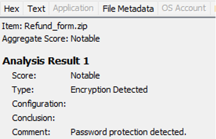
Рисунок 1. Архив с паролем. 

**2.2.	Выполнение необходимого нарушителю программного кода (execution)**
В ходе анализа при распаковке архива, был выявлен файл с расширением «ярлык», который был замаскирован под файл текстового редактора, что не вызвало подозрение у сотрудника, который открыл его.
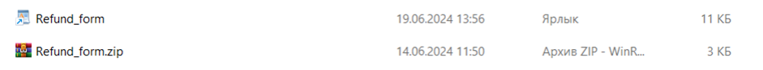
Рисунок 2. Анализ архива. 

    При запуске файла, был выполнен скрипт powershell с зашифрованным содержимым.
 
Рисунок 3. Анализ при помощи volatility. 

Скрипт загружает необходимых для атаки инструментов, которые по сути своей не являются чем-то вредоносным и являются утилитами в свободном доступе, а также выполняет обновление стандартных программ на их версии, которые содержат в себе уязвимости для проникновения. Скрипт подразумевает также скачивание вредоносных файлов с ресурса https://www.sendspace.com
 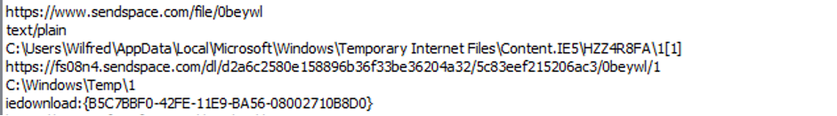
Рисунок 4.Результат работы вредоносного ПО. 

Входе проведенного анализа с использованием антивируса Касперского, удалось установить название вируса:
HEUR:Trojan.WinLNK.Powecod.a — это обнаружение эвристическим анализом потенциально вредоносного файла, похожего на троянскую программу. Теоретически может быть создан для эксплуатации уязвимостей сетевых протоколов, включая SMB, что приведет к утечке информации с устройства, а также может получит удаленный доступ к устройству для злоумышленников. 
 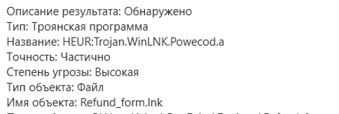
Рисунок 5.Результат сканирования файла. 

Таким образом, злоумышленники собрали необходимый набор для атаки:
1.	Скачены файлы с списком команд для командой строки (111.bat, 2.bat, 3.bat.)
2.	Утилита, предназначенная для выгрузки паролей из браузера IE (iepv.zip)
3.	Программа для сканирования сети (netscan_portable.zip)
4.	Программа для удаленного подключения (RDPWInst-v1.6.2.msi)
5.	Программа для зачистки следов, удаления файлов и отчетов (sdelete.exe).
 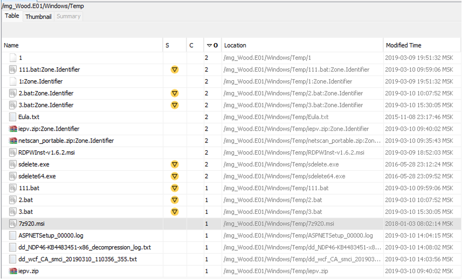
Рисунок 6. Анализ папки Temp.

Скачивание и запуск файлов, не привело к оповещениям защитника Windows Defender. После изучения журнала событий Microsoft-Windows-Windows Defender становится очевидно, что атакующие использовали устаревшие версии Защитника для успешного предотвращения обнаружения, затем удалив всю его историю.

 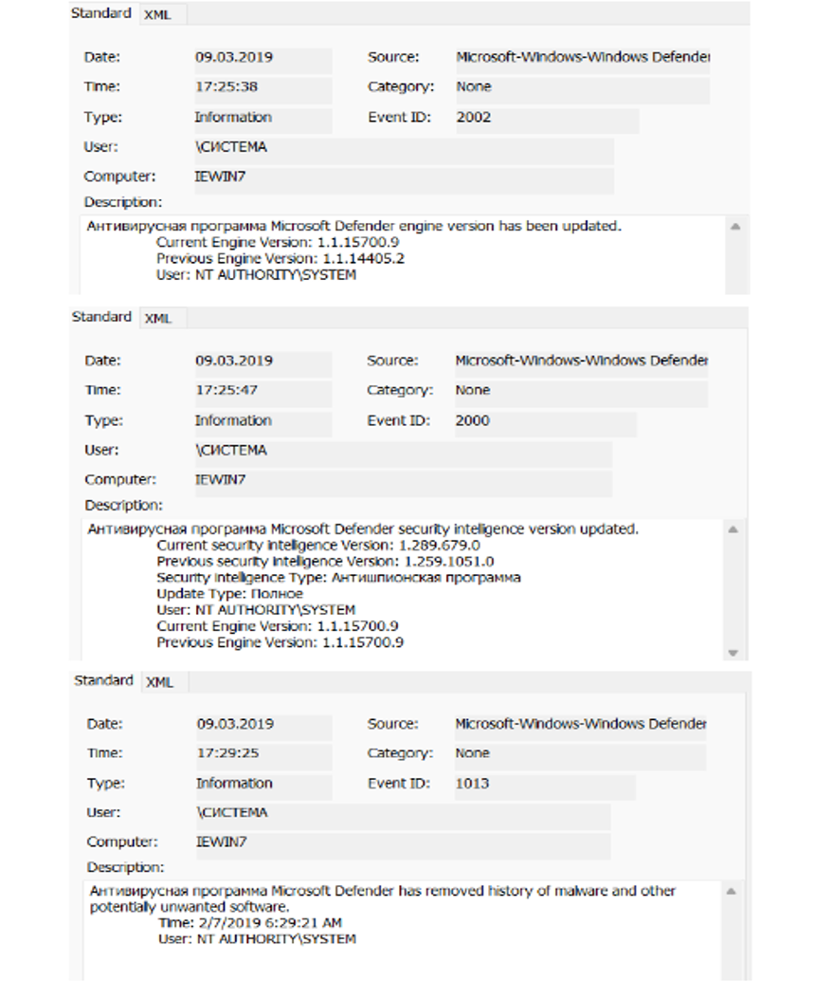
Рисунок 7. Анализ журнала событий Windows Defender

Powershell скрипт, порождающий множество процессов (также с аргументами), переписывающий память процессов и значения реестра:

1.	Скрипт пытается установить связь с адресом 192.168.1.71
 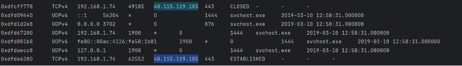
Рисунок 8. Анализ при помощи volatility. 

2.	Скрипт создает задачи в планировщике, а также автозагрузки Windows.
 
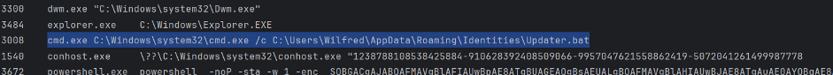
Рисунок 9. Анализ при помощи volatility. 

**3. Повышение привилегий (privilege escalation)**
По информации из журнала RemoteConnectionManager 09.03.19 в 19.36.43 Совершается первое успешное удаленное подключение от имени легитимного локального пользователя. 
Данный факт говорит о том, что у атакующих имеются все необходимые учетные данные легитимного пользователя (логины, пароли)
 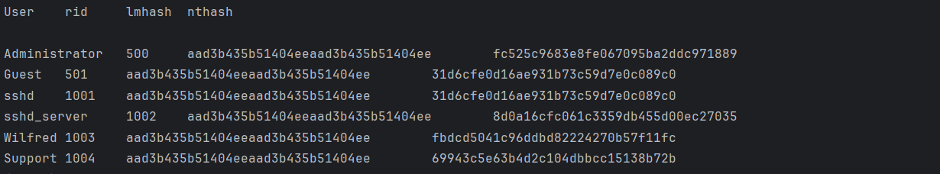
Рисунок 10. Анализ при помощи volatility. 
Данные о системе (так как были необходимы для успешного RDP-подключения). 
 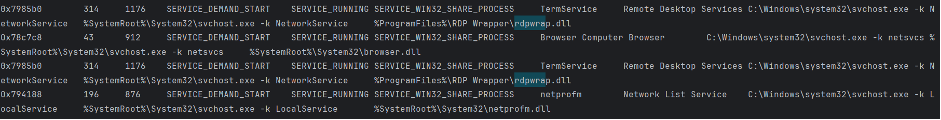
Рисунок 11. Анализ при помощи volatility. 
Пользователь является локальным администратором, поэтому можно считать, что у атакующих появился полный контроль над системой. 
 
Рисунок 12. Анализ атакующих действий 
**4.	Противодействие защите (Defense Evasion)**
Журнал Security. 10.03.19 создается новый пользователь “Support”. В последующих этапах атаки по большей части действуют от него, чтобы не вызывать подозрений у жертвы и иметь возможность действовать более скрытно. Привилегии пользователю Support также были повышены.
 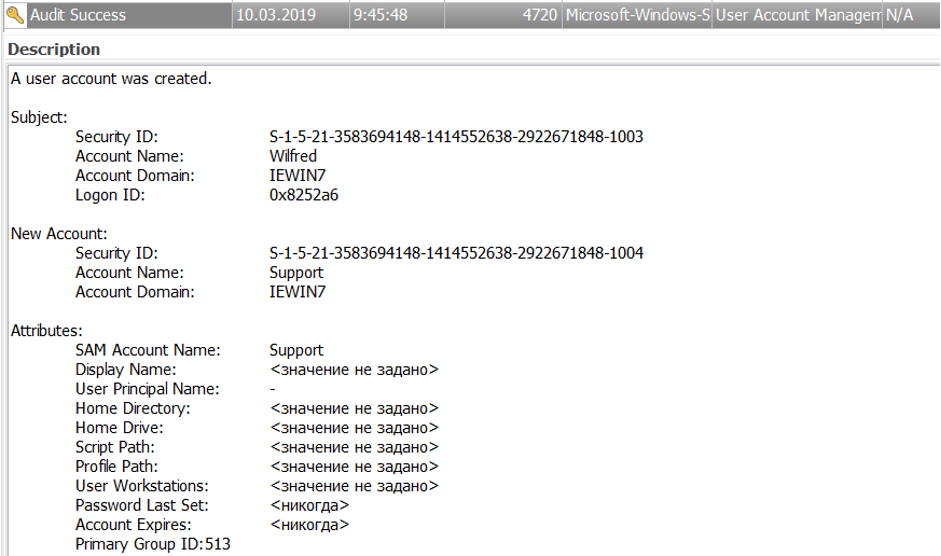
Рисунок 13. Анализ атакующих действий 

**5.	Закрепление (Persistence)**
Пользователь Support для окончательного закрепления в системе использует задачи созданные в стандартном компоненте ОС Windows - Task Scheduler 
 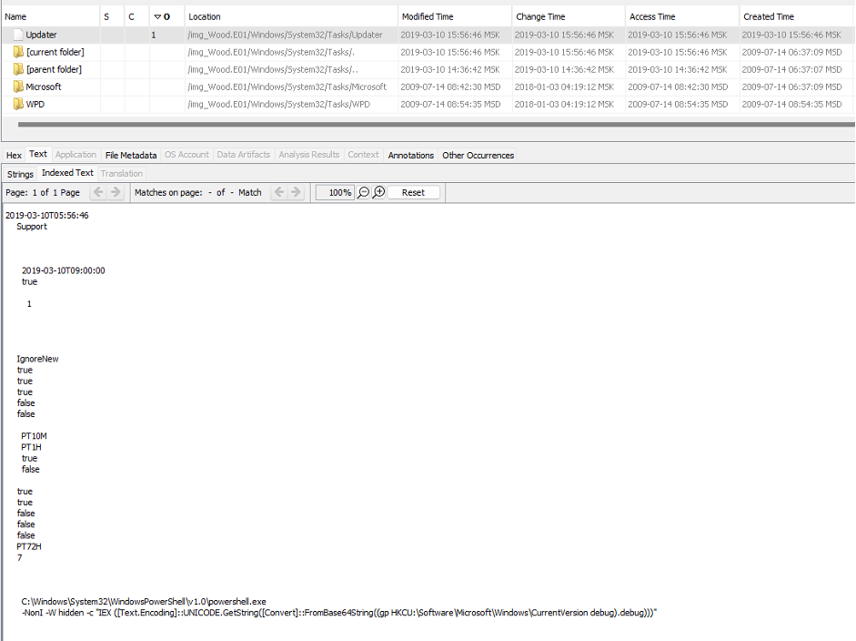
Рисунок 14. Анализ атакующих действий 

Служба «Updater», предназначена с определенной периодичностью исполнять вредоносный скрипт и связываться с адресом атакующих.
 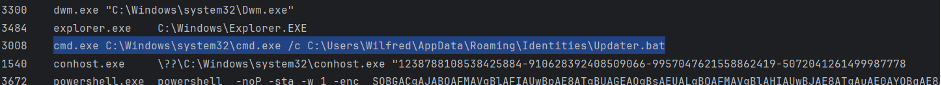
Рисунок 15. Анализ при помощи volatility. 

MP Scheduled Scan вносит изменения в работу сканера Windows Defender, ограничивая привилегии.
Скачанный в папку Temp инструмент SoftPerfect Network Scanner позволяет обнаруживать компьютеры внутри сети, сканировать прослушиваемые порты TCP/UDP и обнаруживает общие папки, в том числе системные и скрытые. Кроме того, он может получить практически любую информацию о сетевых компьютерах через WMI, SNMP, HTTP, NetBios и множество других функций. Он также может разрешать имена хостов и автоматически определять диапазон локальных и внешних IP-адресов.
Очевидно, что данным функционалом воспользовались и атакующие с целью кражи информации, хранящейся на жестком диске и возможного дальнейшего продвижения по сети компании “Х”.

**6.	Эксфильтрация (Exfiltration)**
Для последующей выгрузки информации использовался ресурс https://www.sendspace.com/, после чего атакующими производилось сокрытие следов присутствия.
 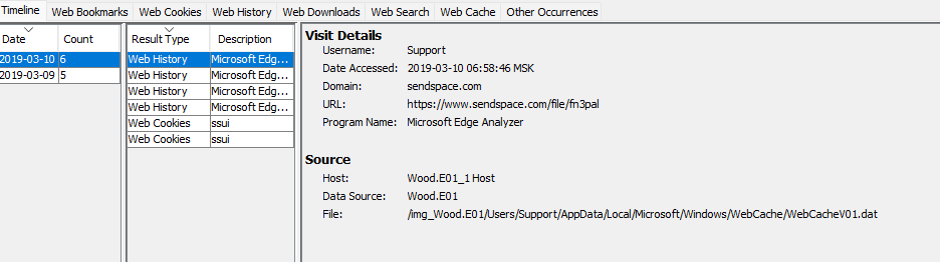
Рисунок 16. Анализ действий атакующих. 

 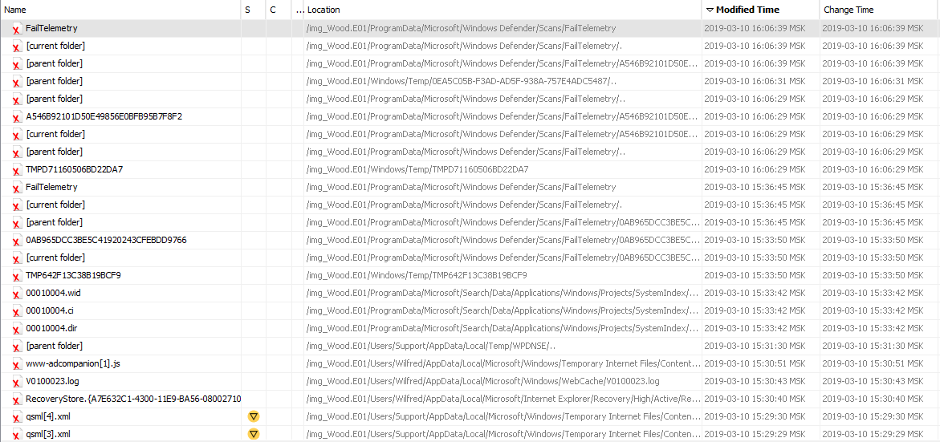
Рисунок 17. Анализ действий атакующих. 

Так же для сокрытия следов активности и запутывания при анализе журналов, было замечено расхождение по времени. Таким образом, скаченный архив был загружен в 14:25, а его запуск произошел в 17:15, что не соответствует действительному времени атаки. Поскольку действия, зафиксированные от вредоносного файла, были выполнены ранее. 

 
Рисунок 18. Анализ действий атакующих. 
Таким образом можно сделать заключение, что атакующие используют программное обеспечение, которое осуществляет сбой в системы времени, поэтому некоторые записи в журнале – интерпретируются с ошибкой в восприятии времени.

***Вывод***
На основе проведенного анализа инцидента информационной безопасности в компании "Х" можно сделать следующий вывод:
Атака началась с фишингового письма, содержащего архив с вредоносным файлом. После открытия файла сотрудником был запущен скрытый PowerShell-скрипт, который загрузил набор инструментов для дальнейшего развития атаки. Злоумышленники использовали различные техники для закрепления в системе, повышения привилегий и сокрытия следов своей активности. Они создали дополнительного пользователя, настроили задачи в планировщике Windows, отключили антивирусную защиту и произвели сканирование сети. В результате атакующие получили удаленный доступ к системе и смогли похитить конфиденциальную информацию, которую затем выгрузили на внешний ресурс.
Инцидент выявил серьезные уязвимости в системе безопасности компании, включая недостаточную защиту от фишинга, слабый контроль за учетными записями и устаревшее программное обеспечение. Для предотвращения подобных атак в будущем необходимо усилить технические меры защиты, обучить сотрудников правилам кибербезопасности, внедрить многофакторную аутентификацию и улучшить мониторинг подозрительной активности в сети. Также важно регулярно обновлять все системы и проводить аудит безопасности.
Этот инцидент подчеркивает важность комплексного подхода к информационной безопасности, сочетающего технические средства защиты с обучением персонала и регулярным обновлением процедур реагирования на инциденты.

**Рекомендации по ликвидации последствий инцидента и восстановлению системы:**

1. Изоляция скомпрометированной системы
- Отключить систему от сети для предотвращения дальнейшего распространения угрозы
- Создать образ системы для последующего анализа

2. Удаление вредоносного ПО и нежелательных изменений
- Удалить все обнаруженные вредоносные файлы и программы 
- Удалить созданного пользователя "Support" и другие подозрительные учетные записи
- Удалить подозрительные задачи из планировщика заданий
- Проверить и очистить автозагрузку Windows от вредоносных элементов

3. Восстановление системы
- Провести полное антивирусное сканирование системы 
- Обновить Windows и все программное обеспечение до актуальных версий
- Восстановить корректные настройки Windows Defender
- Сбросить пароли всех пользователей

4. Усиление защиты
- Настроить более строгие политики безопасности
- Внедрить двухфакторную аутентификацию
- Ограничить права пользователей по принципу наименьших привилегий
- Настроить регулярное резервное копирование

5. Анализ и предотвращение подобных инцидентов
- Провести расследование причин инцидента
- Обучить сотрудников правилам информационной безопасности
- Усилить защиту электронной почты от фишинга
- Внедрить систему мониторинга безопасности

6. Документирование
- Задокументировать все действия по ликвидации последствий
- Обновить план реагирования на инциденты с учетом полученного опыта
