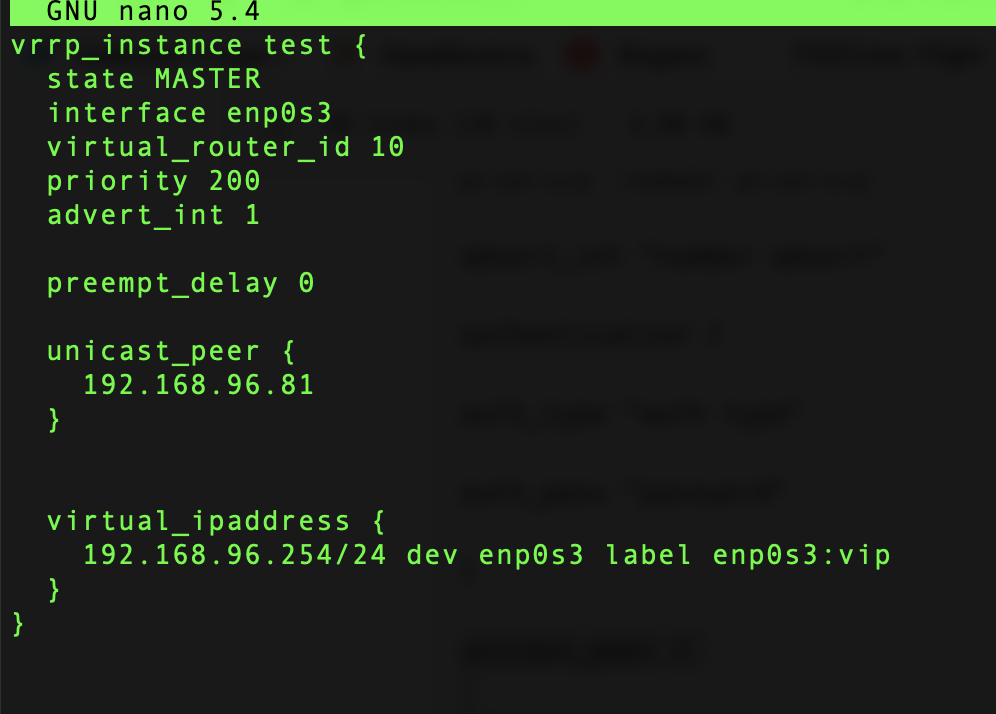
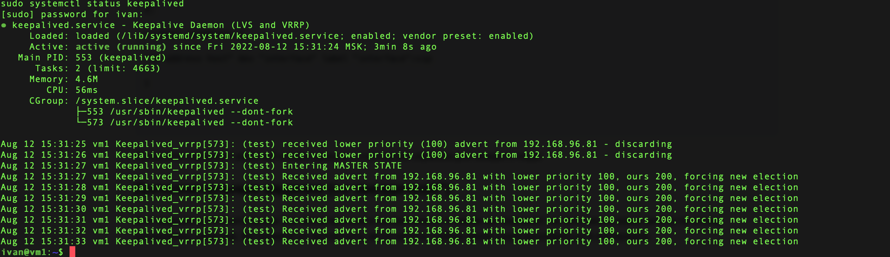
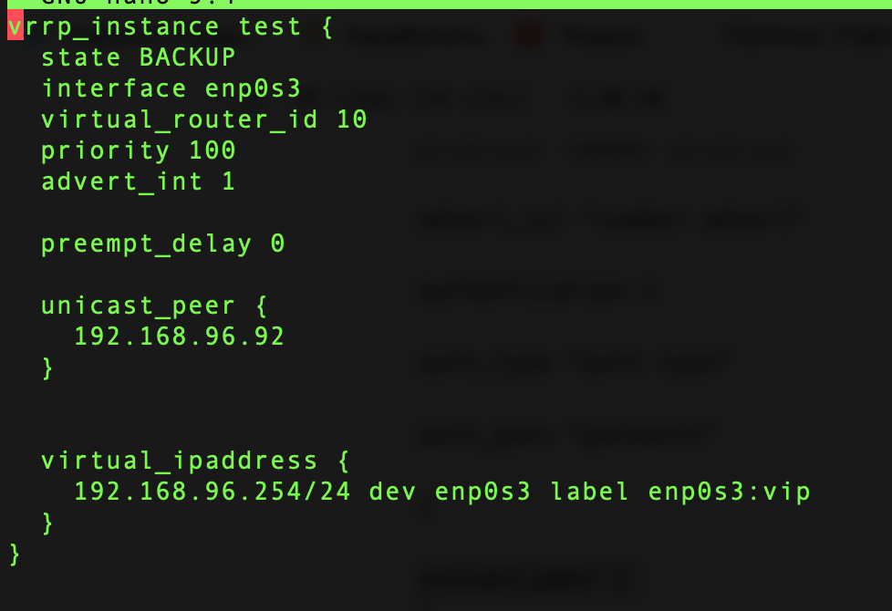
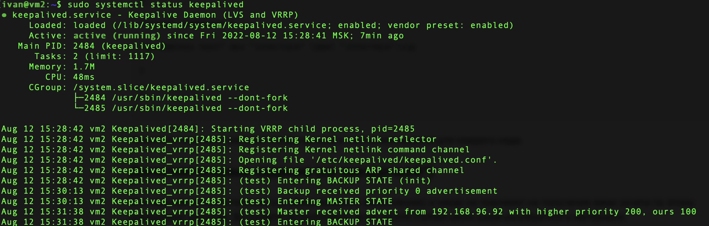
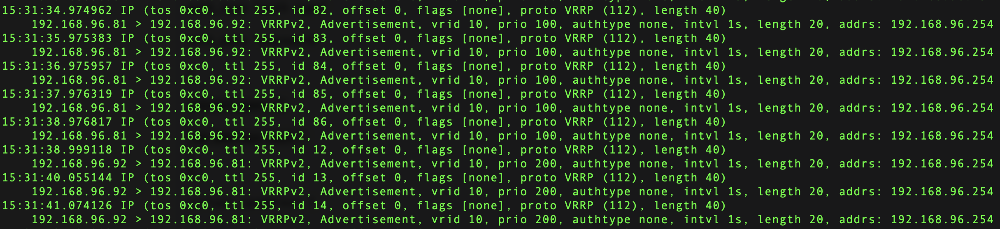
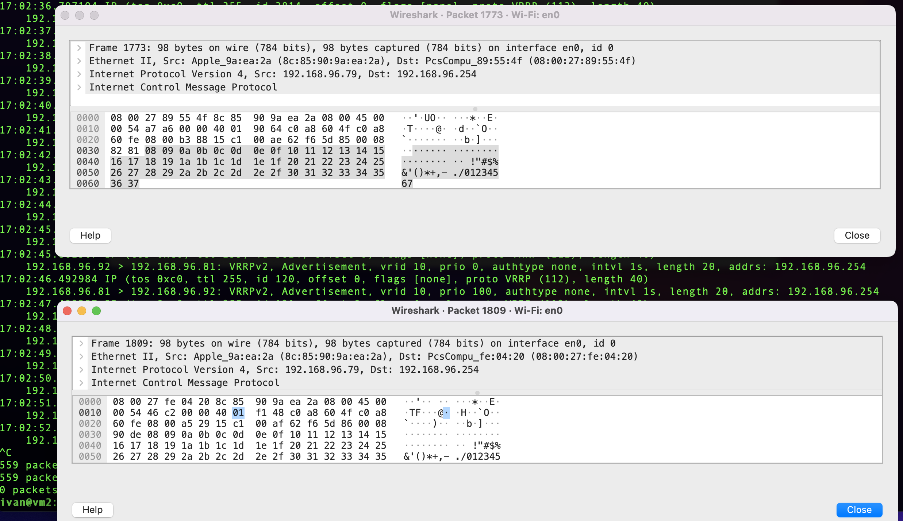

### Задание 1
---

Изначально MASTER ноды была выелючена, после включения и получения информации от BACKUP ноды о том что она в состоянии MASTER и имеет приоретет 100, были иницированы "выборы" и передача управления на MASTER ноду из-за более высшего приоритета.   

Т.к. на момент скриншота MASTER нода была выключена и BACKUP нода не получала от нее информации, то BACKUP нода перевела себя в состояние MASTER. А после случились "выборы" и передача управления, BACKUP нода перешла в состояние BACKUP

из tcpdump видно общение между MASTER и BACKUP нодами, а также передача виртуального адреса от BACKUP MASTER'у

### Задание 2
---

На данном скриншоте видим что в нижнем окне у виртуального IP 192.168.96.254 поменялся  MAC-адрес в связи с тем что MASTER нода была отключена.   
Из tcpdump BACKUP ноды так же видно что она перестала получать информацию от MASTER'a перешла сама в состояние master и начала транслировать в сеть, что теперь она владелец виртуального IP.