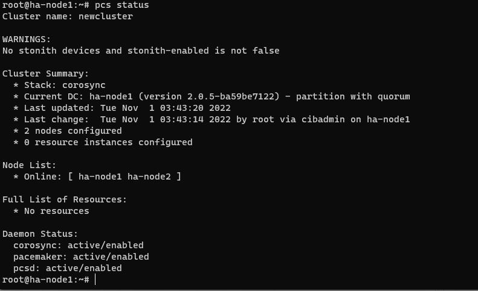
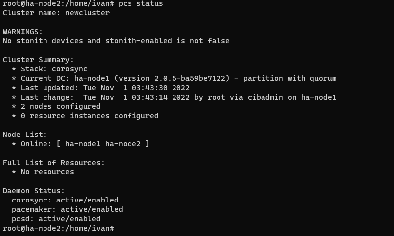
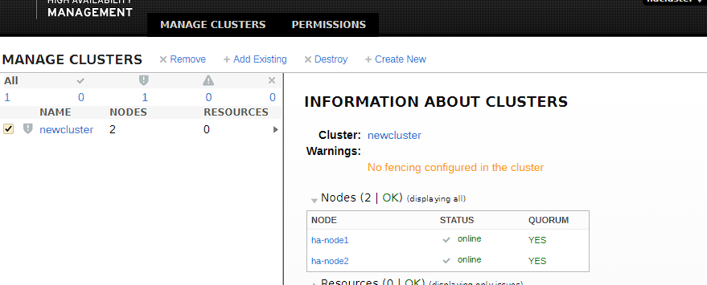
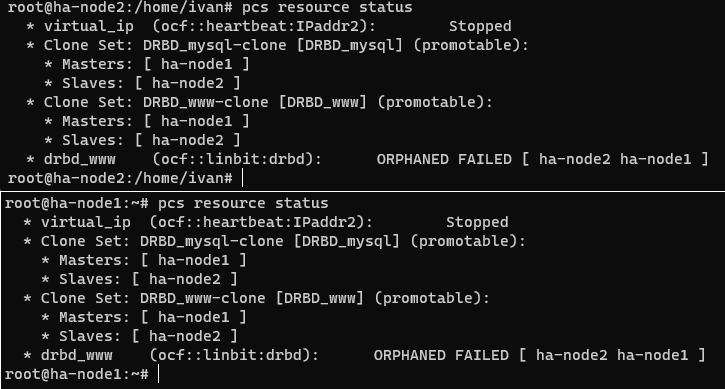

# Домашнее задание к занятию "10.3 Pacemaker"
---

### Задание 1.

Опишите основные функции и назначение Pacemaker.

*Приведите ответ в свободной форме.*

---
Pacemaker - Это менеджер ресурсов кластера, его задача запускать и использовать службы и объекты в рамках одного кластера из дву или более нод. Так же находит и устроняет сбои на уровне нод, служб; поддерживает STONITH; автоматически реплецирует конфиг на все узлы кластера. В целоv следит за кластером созданым при помощи Corosync

### Задание 2.

Опишите основные функции и назначение Corosync.

*Приведите ответ в свободной форме.*

---
Corosync - программный продукт позволяющий создать единый кластер из нескольких аппаратных или виртуальных серверов. Corosunc отслеживает и передает состояние всех нод в кластере. Позволяет мониторить стытусы приложений; оповещать при приложения о смене активной ноды в кластере; отправляет идентичные сообщения процессам во всех нодах; доступ к общей БД с конфигурацией и статистикой; уведомляет об изменениях, произведенных в базе.

### Задание 3.

Соберите модель, состоящую из двух виртуальных машин. Установите pacemaker, corosync, pcs.  Настройте HA кластер.

*Пришлите скриншот рабочей конфигурации и состояния сервиса для каждого нода.*

---

**Нода 1**

**Нода 2**

**WebGUI**

 
---

### Задание 4.

Установите и настройте DRBD сервис для настроенного кластера.

*Пришлите скриншот рабочей конфигурации и состояние сервиса для каждого нода.*

В общем не получилось сделать, в результате копания и использования примеров из презентации. Да и т.к. версия pacemaker на сегодня обновилась некоторые вещи из презентации не стартовали для Pacemaker.
и как результат получилось это:

Те команды что вводил из презентации на ноде1 выдали кучу ошибок и не создали ресурсов, но на ноде2 они появились. Разобрав команду и попробовав сделать ресурсы через WebGUI вроде как получилось, но в консоле они так и не отображаются.   
А нет, нашел:
