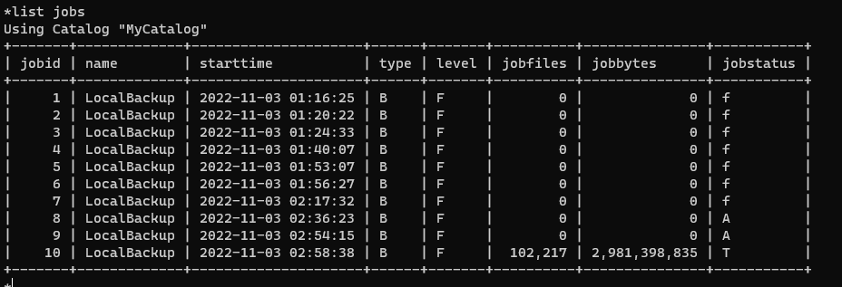
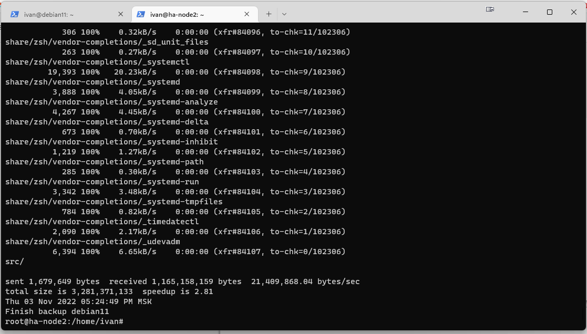

# Домашнее задание к занятию "10.4 Резервное копирование"

---

### Задание 1.

В чем отличие между:

- полное резервное копирование,
- дифференциальное резервное копирование,
- инкрементное резервное копирование.

*Приведите ответ в свободной форме.*

---

При полном копировании мы будем копировать каждый раз все данные которые указаны в плане резервного копирования, При дифференциральном копировании мы каждый раз будет копировать только те данные которые изменились после полного копирования, т.е. точка отсчета всегда будет полная копия. И при инкрементном копировании мы будем копировать данные которые изменились относительно предыдущего копирования. Полное копирование будет самым быстрым в плане востановления, а инкреметное самое медленное, т.к. надо будет востоновить полную копию и все последующие инкрементные копии. Диференциальное копирование нечто среднее между двумя предыдущими, т.к. при востановлении надо будет только востановить полную копию и последнюю дифференциальную копию.

### Задание 2.

Установите программное обеспечении Bacula, настройте bacula-dir, bacula-sd,  bacula-fd. Протестируйте работу сервисов (трех сервисов).

*Пришлите скриншот рабочей конфигурации.*
---   
ПОсле многих безуспешных попыток выяснилось что необходимо на каталог с бэкапами сделать chown bacula:disk иначе не работало ничего.

### Задание 3.

Установите программное обеспечении rsync. Настройте синхронизацию на двух нодах. Протестируйте работу сервиса.

*Пришлите скриншот рабочей конфигурации.*

---
Произвел настройки из презентации, результат работы положительный. Данные с удаленного хоста копируются   

