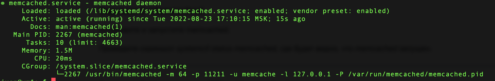
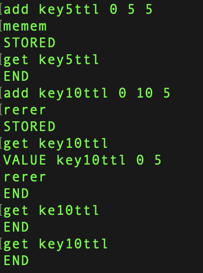
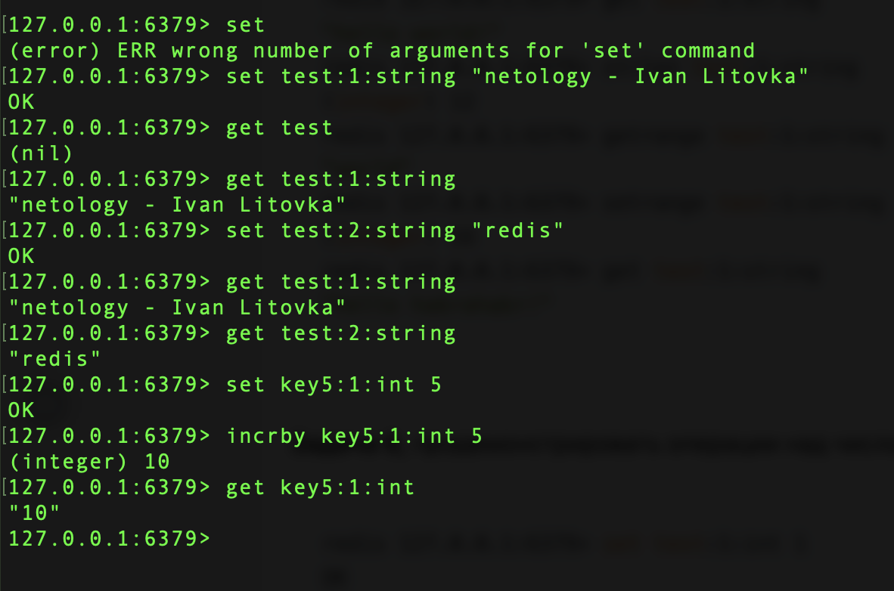

### Задание 1
---
Оснавная задача кэширования - это решить проблему со скорость доступа данных, путем сохранения информации о често запрашиваемых 
данных.

### Задание 2
---

### Задание 3
---
привем записи данных с TTL 5 и 10, с ТТЛ 5 не успеем даже посмотреть значения, данные удаляются

### Задание 4, 5
---

