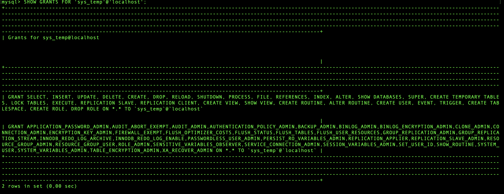
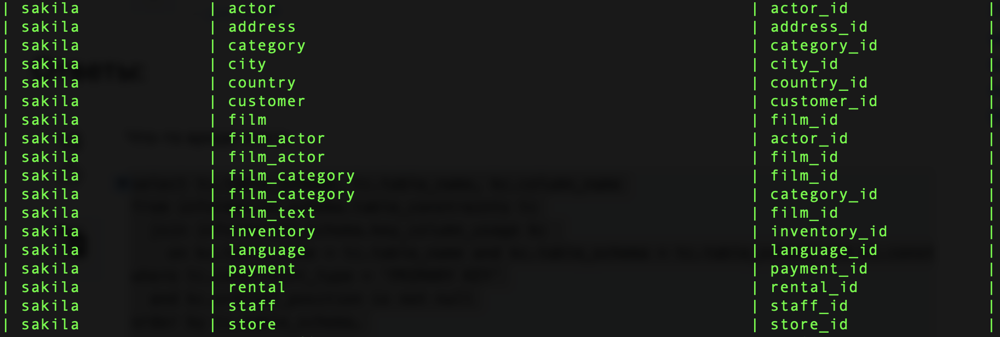

### Задание 1
---
Список пользователей


Список прав пользователя sys_temp


Список таблиц из развернутой базы sikila
![]./img/12.2.3.png)

### Задание 2
---

Как это работает понять не могу, но работает
```
select tc.table_schema, tc.table_name, kc.column_name 
 from information_schema.table_constraints tc, information_schema.key_column_usage kc
 where tc.constraint_type = 'PRIMARY KEY' and kc.table_name = tc.table_name and 
 kc.table_schema = tc.table_schema and kc.constraint_name = tc.constraint_name order by 1, 2;
```


### Задание 3
---
```
REVOKE INSERT,UPDATE,DELETE ON sakila . * FROM 'sys_temp'@'localhost';
SHOW GRANTS FOR 'sys_temp'@'localhost';
```


