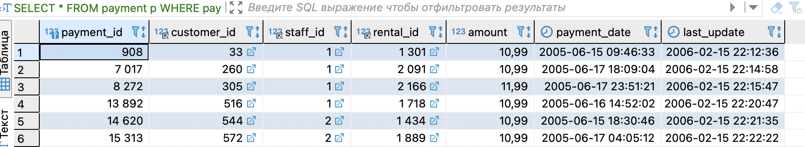
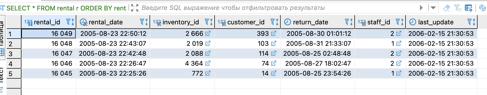

### Задание 1
---
```
SELECT DISTINCT  district 
FROM address a 
WHERE LEFT (district, 1) = 'K' AND RIGHT (district,1) = 'a' AND POSITION(' ' IN district) = 0
```


### Задание 2
---
```
SELECT *
FROM payment p 
WHERE payment_date BETWEEN '2005-06-15' AND '2005-06-18' AND amount >= 10
```


### Задание 3
---
```
SELECT *
FROM rental r 
ORDER BY rental_id DESC 
LIMIT 5
```

