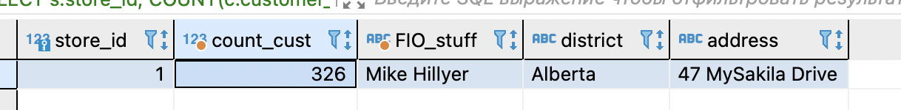
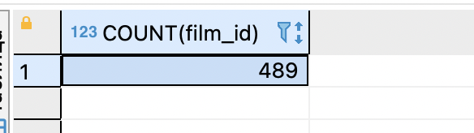
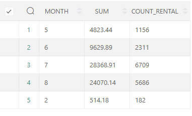
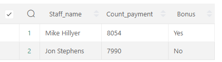

### Задание 1
---
```
SELECT 	s.store_id,
	COUNT(c.customer_id) AS count_cust,
	CONCAT_WS(' ',s2.first_name,s2.last_name) AS FIO_stuff,
	a.district,
	a.address 
FROM customer c 
JOIN store s ON c.store_id = s.store_id 
JOIN staff s2 ON s.manager_staff_id = s2.staff_id 
JOIN address a ON s.address_id = a.address_id 
GROUP BY s.store_id 
HAVING COUNT(c.customer_id)  > 300
```


### Задание 2
---
```
SELECT COUNT(film_id) 
FROM film
WHERE `length` >= (SELECT AVG(`length`) from film)
```


### Задание 3
---
```
SELECT  MONTH(p.payment_date) AS MONTH,
        SUM(p.amount) AS SUM,
        COUNT (r.rental_id) AS COUNT_RENTAL
FROM payment p
JOIN rental r ON p.rental_id = r.rental_id
GROUP BY Month(p.payment_date)
```


### Задание 4
---
```
SELECT  CONCAT_WS(' ',s.first_name,s.last_name) AS Staff_name,
        COUNT(p.payment_id) AS Count_payment,
        CASE
           WHEN COUNT(p.payment_id) > 8000 THEN 'Yes'
           WHEN COUNT(p.payment_id) < 8000 THEN 'No'
        END AS Bonus
FROM payment p
JOIN staff s ON p.staff_id = s.staff_id
GROUP BY CONCAT_WS(' ',s.first_name,s.last_name);
```
