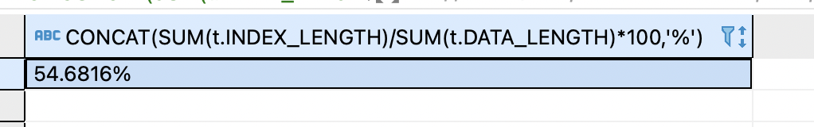

### Задание 1
---
```sql
SELECT CONCAT(SUM(t.INDEX_LENGTH)/SUM(t.DATA_LENGTH)*100,'%')
FROM information_schema.TABLES t 
WHERE t.TABLE_SCHEMA = 'sakila'
```


### Задание 2
---
Не могу разобраться как оптимизировать данный запрос.
МОжно добавить индекс для поля p.payment, чтобы искать быстрее по дате.  
Еще можно заменит конструкцию sum(p.amount) over (partition by c.customer_id, f.title) на использование GROUP BY и это сократит кол-во 
обрабатываемых строк.
